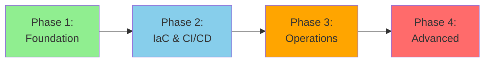

# ⚙️ DevOps Engineer Learning Path

> __🏠 [Home](../../../../README.md)__ | __📖 [Documentation](../../../README.md)__ | __🎓 [Tutorials](../../README.md)__ | __🛤️ [Learning Paths](../README.md)__ | __⚙️ DevOps Engineer__


__Master DevOps practices for Azure analytics platforms. Build CI/CD pipelines, implement Infrastructure as Code, and automate deployment, monitoring, and operations for data engineering workloads.__

## 🎯 Learning Objectives

After completing this learning path, you will be able to:

- __Implement__ CI/CD pipelines for data engineering workflows
- __Automate__ infrastructure deployment with Infrastructure as Code (IaC)
- __Deploy__ Azure analytics services using Bicep, Terraform, and ARM templates
- __Configure__ monitoring, logging, and alerting for data platforms
- __Implement__ disaster recovery and business continuity strategies
- __Optimize__ costs and resource utilization
- __Ensure__ security, compliance, and governance automation

## 📋 Prerequisites Checklist

Before starting this learning path, ensure you have:

### __Required Knowledge__

- [ ] __DevOps fundamentals__ - Understanding of CI/CD, version control, automation
- [ ] __Azure basics__ - Familiarity with Azure portal, resources, and services
- [ ] __Scripting__ - Proficiency in PowerShell, Bash, or Python
- [ ] __Git__ - Experience with branching, merging, pull requests
- [ ] __Linux and Windows__ - Basic system administration skills

### __Required Skills__

- [ ] __Command line__ - Comfortable with terminal/PowerShell
- [ ] __YAML/JSON__ - Understanding of configuration file formats
- [ ] __Networking__ - Basic TCP/IP, DNS, firewalls, VPN concepts
- [ ] __Security__ - Understanding of authentication, authorization, encryption

### __Required Access__

- [ ] __Azure subscription__ with Owner or Contributor role
- [ ] __GitHub or Azure DevOps account__ for version control and CI/CD
- [ ] __Development tools__ - VS Code, Azure CLI, PowerShell, Git
- [ ] __Sufficient credits__ (~$250-300 for complete path)

### __Recommended Background__

- [ ] Experience with containers (Docker)
- [ ] Familiarity with Kubernetes concepts
- [ ] Understanding of data engineering workflows
- [ ] Exposure to monitoring and logging tools

## 🗺️ Learning Path Structure

This path consists of __4 progressive phases__ from automation basics to advanced DevOps practices:



### __Time Investment__

- __Full-Time__ (40 hrs/week): 10-12 weeks
- __Part-Time__ (20 hrs/week): 16-20 weeks
- __Casual__ (10 hrs/week): 24-30 weeks

## 📚 Phase 1: DevOps Foundation (2-3 weeks)

__Goal__: Build foundational automation and scripting skills for Azure

### __Module 1.1: Azure DevOps Fundamentals__ (10 hours)

__Learning Objectives:__

- Understand DevOps principles and practices
- Navigate Azure Portal, Azure CLI, and PowerShell
- Manage Azure resources programmatically
- Implement proper authentication and authorization

__Hands-on Exercises:__

1. __Lab 1.1.1__: Set up Azure CLI and PowerShell environment
2. __Lab 1.1.2__: Create and manage Azure resources via CLI
3. __Lab 1.1.3__: Implement service principal authentication
4. __Lab 1.1.4__: Manage Azure RBAC with scripts

__Resources:__

- [Azure CLI Documentation](https://learn.microsoft.com/cli/azure/)
- [Azure PowerShell Documentation](https://learn.microsoft.com/powershell/azure/)

__Assessment:__

- Automate creation of Azure Synapse workspace using CLI
- Implement RBAC assignment script

### __Module 1.2: Scripting and Automation__ (12 hours)

__Learning Objectives:__

- Write PowerShell scripts for Azure automation
- Use Python for Azure resource management
- Implement error handling and logging
- Create reusable automation modules

__Hands-on Exercises:__

1. __Lab 1.2.1__: Build PowerShell module for resource deployment
2. __Lab 1.2.2__: Create Python scripts using Azure SDK
3. __Lab 1.2.3__: Implement logging and error handling
4. __Lab 1.2.4__: Schedule automation with Azure Automation

__Sample Scripts:__

- Resource health check automation
- Cost reporting and alerts
- Backup and recovery automation
- Security compliance scanning

### __Module 1.3: Version Control and Collaboration__ (8 hours)

__Learning Objectives:__

- Master Git workflows (branching, merging, rebasing)
- Implement GitFlow or trunk-based development
- Use pull requests for code review
- Manage secrets and sensitive data

__Hands-on Exercises:__

1. __Lab 1.3.1__: Set up Git repository with proper structure
2. __Lab 1.3.2__: Implement branching strategy
3. __Lab 1.3.3__: Create pull request workflow
4. __Lab 1.3.4__: Manage secrets with Azure Key Vault

__Resources:__

- [Git Best Practices](https://git-scm.com/book/en/v2)
- [GitHub Flow](https://guides.github.com/introduction/flow/)

## 📚 Phase 2: Infrastructure as Code & CI/CD (3-4 weeks)

__Goal__: Master IaC and build automated deployment pipelines

### __Module 2.1: Infrastructure as Code with Bicep__ (14 hours)

__Learning Objectives:__

- Understand ARM template structure and syntax
- Write Bicep templates for Azure resources
- Implement modular and reusable templates
- Manage template parameters and outputs

__Hands-on Exercises:__

1. __Lab 2.1.1__: Create Bicep templates for Synapse workspace
2. __Lab 2.1.2__: Build modular templates with parameters
3. __Lab 2.1.3__: Implement template validation and testing
4. __Lab 2.1.4__: Deploy multi-resource environments

__Sample Templates:__

```bicep
// Azure Synapse Workspace
resource synapseWorkspace 'Microsoft.Synapse/workspaces@2021-06-01' = {
  name: workspaceName
  location: location
  identity: {
    type: 'SystemAssigned'
  }
  properties: {
    defaultDataLakeStorage: {
      accountUrl: storageAccountUrl
      filesystem: fileSystemName
    }
    sqlAdministratorLogin: sqlAdminUsername
    sqlAdministratorLoginPassword: sqlAdminPassword
  }
}
```

### __Module 2.2: Infrastructure as Code with Terraform__ (14 hours)

__Learning Objectives:__

- Understand Terraform workflow (init, plan, apply)
- Write Terraform configurations for Azure
- Manage state and backends
- Implement modules and workspaces

__Hands-on Exercises:__

1. __Lab 2.2.1__: Set up Terraform with Azure provider
2. __Lab 2.2.2__: Create reusable Terraform modules
3. __Lab 2.2.3__: Manage remote state with Azure Storage
4. __Lab 2.2.4__: Implement multi-environment deployments

__Sample Configuration:__

```hcl
resource "azurerm_synapse_workspace" "main" {
  name                                 = var.workspace_name
  resource_group_name                  = azurerm_resource_group.main.name
  location                             = azurerm_resource_group.main.location
  storage_data_lake_gen2_filesystem_id = azurerm_storage_data_lake_gen2_filesystem.main.id
  sql_administrator_login              = var.sql_admin_username
  sql_administrator_login_password     = var.sql_admin_password

  identity {
    type = "SystemAssigned"
  }
}
```

### __Module 2.3: CI/CD Pipelines__ (16 hours)

__Learning Objectives:__

- Build CI/CD pipelines with GitHub Actions
- Implement Azure DevOps pipelines
- Automate testing and validation
- Deploy across multiple environments

__Hands-on Exercises:__

1. __Lab 2.3.1__: Create GitHub Actions workflow for IaC deployment
2. __Lab 2.3.2__: Build Azure Pipelines for data engineering
3. __Lab 2.3.3__: Implement automated testing in pipelines
4. __Lab 2.3.4__: Deploy to dev, staging, production environments

__Resources:__

- [DevOps CI/CD Guide](../../../devops/pipeline-ci-cd.md)
- [Automated Testing Guide](../../../devops/automated-testing.md)

__Sample GitHub Actions Workflow:__

```yaml
name: Deploy Synapse Infrastructure

on:
  push:
    branches: [main]
  pull_request:
    branches: [main]

jobs:
  deploy:
    runs-on: ubuntu-latest
    steps:
      - uses: actions/checkout@v3

      - name: Azure Login
        uses: azure/login@v1
        with:
          creds: ${{ secrets.AZURE_CREDENTIALS }}

      - name: Deploy Bicep
        run: |
          az deployment group create \
            --resource-group ${{ secrets.RESOURCE_GROUP }} \
            --template-file ./infrastructure/main.bicep \
            --parameters ./infrastructure/parameters.json
```

## 📚 Phase 3: Operations and Monitoring (2-3 weeks)

__Goal__: Implement comprehensive monitoring, logging, and operational excellence

### __Module 3.1: Monitoring and Observability__ (12 hours)

__Learning Objectives:__

- Configure Azure Monitor for data workloads
- Set up Log Analytics workspaces
- Create custom dashboards and workbooks
- Implement distributed tracing

__Hands-on Exercises:__

1. __Lab 3.1.1__: Set up Azure Monitor for Synapse Analytics
2. __Lab 3.1.2__: Create Log Analytics queries (KQL)
3. __Lab 3.1.3__: Build monitoring dashboards
4. __Lab 3.1.4__: Implement Application Insights for pipelines

__Resources:__

- [Monitoring Setup Guide](../../../monitoring/README.md)
- [Spark Monitoring](../../../monitoring/spark-monitoring.md)
- [SQL Monitoring](../../../monitoring/sql-monitoring.md)

### __Module 3.2: Alerting and Incident Response__ (10 hours)

__Learning Objectives:__

- Create metric and log-based alerts
- Implement action groups and notifications
- Design runbooks for common incidents
- Integrate with incident management systems

__Hands-on Exercises:__

1. __Lab 3.2.1__: Set up alerts for critical metrics
2. __Lab 3.2.2__: Create automated remediation with Azure Automation
3. __Lab 3.2.3__: Build incident response runbooks
4. __Lab 3.2.4__: Integrate with PagerDuty/ServiceNow

__Alert Examples:__

- Pipeline failure notifications
- Resource utilization thresholds
- Cost anomaly detection
- Security compliance violations

### __Module 3.3: Backup, Recovery, and Business Continuity__ (12 hours)

__Learning Objectives:__

- Implement backup strategies for data platforms
- Design disaster recovery procedures
- Test failover and recovery scenarios
- Document RTO and RPO requirements

__Hands-on Exercises:__

1. __Lab 3.3.1__: Configure Azure Backup for data services
2. __Lab 3.3.2__: Implement geo-replication for critical data
3. __Lab 3.3.3__: Create and test disaster recovery plan
4. __Lab 3.3.4__: Automate backup validation

__Resources:__

- [Best Practices: Cost Optimization](../../../best-practices/cost-optimization.md)

## 📚 Phase 4: Advanced DevOps Practices (3-4 weeks)

__Goal__: Master advanced automation, security, and optimization

### __Module 4.1: GitOps and Advanced Automation__ (14 hours)

__Learning Objectives:__

- Implement GitOps principles for infrastructure
- Use ArgoCD or Flux for continuous deployment
- Automate configuration management
- Implement policy as code

__Hands-on Exercises:__

1. __Lab 4.1.1__: Set up GitOps workflow for infrastructure
2. __Lab 4.1.2__: Implement Azure Policy as code
3. __Lab 4.1.3__: Automate configuration drift detection
4. __Lab 4.1.4__: Build self-healing infrastructure

### __Module 4.2: Security Automation__ (12 hours)

__Learning Objectives:__

- Implement DevSecOps practices
- Automate security scanning and compliance
- Manage secrets and certificates
- Implement network security automation

__Hands-on Exercises:__

1. __Lab 4.2.1__: Integrate security scanning in CI/CD
2. __Lab 4.2.2__: Automate vulnerability management
3. __Lab 4.2.3__: Implement certificate rotation automation
4. __Lab 4.2.4__: Set up Azure Security Center policies

__Resources:__

- [Security Best Practices](../../../best-practices/security.md)
- [Network Security](../../../best-practices/network-security.md)

### __Module 4.3: Cost Optimization and FinOps__ (10 hours)

__Learning Objectives:__

- Implement cost monitoring and alerting
- Automate resource rightsizing
- Implement scheduled scaling
- Create cost allocation and chargeback reports

__Hands-on Exercises:__

1. __Lab 4.3.1__: Build cost monitoring dashboards
2. __Lab 4.3.2__: Implement auto-scaling for Spark pools
3. __Lab 4.3.3__: Create cost optimization recommendations
4. __Lab 4.3.4__: Automate resource cleanup

__Automation Examples:__

- Auto-pause idle Synapse pools
- Schedule compute for business hours
- Cleanup orphaned resources
- Implement budget alerts

### __Module 4.4: Capstone Project__ (20 hours)

__Requirements:__

Build a complete DevOps solution including:

1. __Infrastructure as Code__: Multi-environment deployment (dev, staging, prod)
2. __CI/CD Pipelines__: Automated testing, deployment, and rollback
3. __Monitoring__: Comprehensive observability with dashboards and alerts
4. __Security__: Automated security scanning and compliance
5. __Documentation__: Runbooks, architecture diagrams, operational guides
6. __Disaster Recovery__: Tested backup and recovery procedures

__Deliverables:__

- Complete IaC templates (Bicep or Terraform)
- CI/CD pipeline configurations
- Monitoring and alerting setup
- Security and compliance automation
- Operational runbooks and documentation
- Cost optimization recommendations

## 🎓 Certification Alignment

This learning path prepares you for:

- __Azure DevOps Engineer Expert (AZ-400)__ - Primary focus
- __Azure Administrator Associate (AZ-104)__ - Foundational
- __Azure Data Engineer Associate (DP-203)__ - Data platform focus

## 📊 Skills Assessment

### __Self-Assessment Checklist__

Rate your skills (1-5, where 5 is expert):

#### __Infrastructure as Code__ (Target: 4-5)

- [ ] Write and maintain Bicep/Terraform templates
- [ ] Implement modular and reusable infrastructure code
- [ ] Manage state and handle conflicts
- [ ] Deploy multi-environment infrastructure

#### __CI/CD__ (Target: 4-5)

- [ ] Build and maintain CI/CD pipelines
- [ ] Implement automated testing
- [ ] Manage pipeline secrets and variables
- [ ] Deploy across multiple environments

#### __Operations__ (Target: 4-5)

- [ ] Configure comprehensive monitoring
- [ ] Create and manage alerts
- [ ] Write operational runbooks
- [ ] Implement backup and recovery

#### __Automation__ (Target: 3-4)

- [ ] Write PowerShell and Python automation
- [ ] Implement scheduled tasks
- [ ] Create self-healing systems
- [ ] Automate security and compliance

## 💡 Learning Tips

### __Study Strategies__

- __Automate everything__: Look for repetitive tasks to automate
- __Test thoroughly__: Always validate IaC and pipelines in dev environment
- __Document as you go__: Create runbooks and wiki pages
- __Learn from failures__: Analyze pipeline failures to improve
- __Stay current__: Follow Azure DevOps updates and best practices

### __Recommended Resources__

#### __Books__

- "The DevOps Handbook" by Gene Kim
- "Infrastructure as Code" by Kief Morris
- "Continuous Delivery" by Jez Humble
- "Site Reliability Engineering" by Google

#### __Communities__

- Azure DevOps Community
- r/azuredevops subreddit
- Azure DevOps Discord/Slack channels
- Local DevOps meetups

### __Practice Projects__

- Automate your development environment setup
- Build IaC templates for common architectures
- Create reusable pipeline templates
- Contribute to open-source DevOps projects

## 🔗 Next Steps

After completing this path:

- __Specialize__: Focus on Kubernetes, containers, or cloud-native
- __Expand__: Learn multi-cloud DevOps (AWS, GCP)
- __Lead__: Drive DevOps transformation in your organization
- __Share__: Present at meetups and conferences

### __Advanced Topics__

- Kubernetes and containerization
- Service mesh (Istio, Linkerd)
- Chaos engineering
- Advanced GitOps patterns
- Platform engineering

## 🎉 Success Stories

> __"This learning path transformed how we deploy analytics infrastructure. We went from manual deployments taking days to fully automated deployments in minutes."__
> *- David, DevOps Engineer*

> __"The CI/CD and monitoring modules were game-changers. We now have full visibility into our data platform and can respond to issues proactively."__
> *- Sarah, Platform Engineer*

## 📞 Getting Help

- __Technical Questions__: [Azure DevOps Documentation](https://learn.microsoft.com/azure/devops/)
- __Community Forum__: [GitHub Discussions](https://github.com/your-org/csa-tutorials/discussions)
- __Office Hours__: Weekly DevOps Q&A sessions
- __Support__: Azure DevOps technical support

---

__Ready to start?__ Begin with [Phase 1: DevOps Foundation](#-phase-1-devops-foundation-2-3-weeks)

---

*Last Updated: January 2025*
*Learning Path Version: 1.0*
*Maintained by: DevOps Team*
