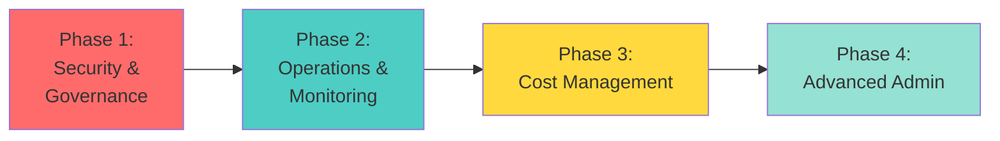
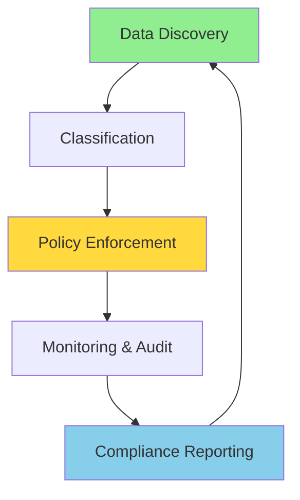

# 🔧 Platform Administrator Learning Path

> __🏠 [Home](../../../README.md)__ | __📖 [Documentation](../../README.md)__ | __🎓 [Tutorials](../README.md)__ | __🛤️ [Learning Paths](README.md)__ | __🔧 Platform Admin__


__Master the administration, security, and operations of Azure analytics platforms. Build expertise in governance, monitoring, cost management, and ensuring enterprise-grade reliability and compliance.__

## 🎯 Learning Objectives

After completing this learning path, you will be able to:

- __Configure and manage__ Azure Synapse Analytics workspaces at enterprise scale
- __Implement comprehensive security__ including network isolation, identity management, and data protection
- __Establish governance frameworks__ for data access, quality, and compliance
- __Monitor and optimize__ platform performance and costs
- __Automate operational tasks__ using PowerShell, CLI, and Azure DevOps
- __Ensure business continuity__ with backup, disaster recovery, and high availability
- __Support data teams__ with troubleshooting and performance tuning

## 📋 Prerequisites Checklist

Before starting this learning path, ensure you have:

### __Required Knowledge__

- [ ] __Azure fundamentals__ - Strong understanding of Azure resource management
- [ ] __Networking basics__ - VNets, subnets, NSGs, private endpoints
- [ ] __Security concepts__ - Identity management, RBAC, encryption
- [ ] __PowerShell or CLI__ - Basic scripting and automation skills
- [ ] __Windows/Linux administration__ - System administration experience

### __Required Access__

- [ ] __Azure subscription__ with Owner or User Access Administrator role
- [ ] __Azure AD privileges__ to create service principals and manage identities
- [ ] __Sufficient budget__ for production-like environment (~$300-500)

### __Recommended Experience__

- [ ] __IT infrastructure management__ - 1-2 years experience
- [ ] __Cloud administration__ - Azure or other cloud platforms
- [ ] __SQL Server administration__ - Helpful for dedicated SQL pools
- [ ] __DevOps practices__ - CI/CD, Infrastructure as Code

## 🗺️ Learning Path Structure

This path consists of __4 progressive phases__ focused on security, governance, operations, and optimization:



### __Time Investment__

- __Full-Time__ (40 hrs/week): 8-10 weeks
- __Part-Time__ (15 hrs/week): 14-18 weeks
- __Casual__ (8 hrs/week): 20-24 weeks

## 📚 Phase 1: Security & Governance (3-4 weeks)

__Goal__: Implement enterprise-grade security and governance for analytics platforms

### __Module 1.1: Identity and Access Management__ (16 hours)

__Learning Objectives:__

- Configure Azure AD integration and authentication
- Implement role-based access control (RBAC)
- Manage service principals and managed identities
- Establish least-privilege access principles

__Hands-on Exercises:__

1. __Lab 1.1.1__: Configure Azure AD authentication for Synapse workspace
2. __Lab 1.1.2__: Create custom RBAC roles for data access
3. __Lab 1.1.3__: Implement managed identities for automated processes
4. __Lab 1.1.4__: Set up conditional access policies

__Security Best Practices:__

- Use managed identities instead of service principals when possible
- Implement just-in-time (JIT) privileged access
- Enable MFA for all administrative accounts
- Regular access reviews and permission audits

__Resources:__

- [Security Best Practices](../../../best-practices/security.md)
- [Network Security](../../../best-practices/network-security.md)

__Assessment Questions:__

1. What is the difference between RBAC and resource-level permissions?
2. When should you use managed identities vs service principals?
3. How do you implement the principle of least privilege?
4. What are the implications of owner-level access?

---

### __Module 1.2: Network Security and Isolation__ (16 hours)

__Learning Objectives:__

- Design network architecture with VNet integration
- Configure private endpoints and managed VNets
- Implement firewall rules and IP whitelisting
- Set up Azure Private Link for secure connectivity

__Hands-on Exercises:__

1. __Lab 1.2.1__: Create managed VNet for Synapse workspace
2. __Lab 1.2.2__: Configure private endpoints for all services
3. __Lab 1.2.3__: Set up Azure Firewall for outbound traffic control
4. __Lab 1.2.4__: Implement VNet peering for cross-region access

__Network Architecture Example:__

```text
┌─────────────────────────────────────────────────┐
│  Azure Virtual Network (10.0.0.0/16)            │
│                                                  │
│  ┌──────────────────────────────────────────┐  │
│  │  Synapse Subnet (10.0.1.0/24)            │  │
│  │  - Managed VNet                          │  │
│  │  - Private Endpoints                      │  │
│  └──────────────────────────────────────────┘  │
│                                                  │
│  ┌──────────────────────────────────────────┐  │
│  │  Data Services Subnet (10.0.2.0/24)      │  │
│  │  - Storage Private Endpoints             │  │
│  │  - Key Vault Private Endpoints           │  │
│  └──────────────────────────────────────────┘  │
└─────────────────────────────────────────────────┘
```

__Resources:__

- [Private Link Architecture](../../../architecture/private-link-architecture.md)

__Assessment Questions:__

1. What are the benefits of managed VNet for Synapse?
2. How do private endpoints improve security?
3. What is the difference between service endpoints and private endpoints?
4. How do you troubleshoot private endpoint connectivity issues?

---

### __Module 1.3: Data Protection and Encryption__ (12 hours)

__Learning Objectives:__

- Implement encryption at rest and in transit
- Configure Azure Key Vault for secrets management
- Enable Transparent Data Encryption (TDE)
- Implement dynamic data masking and column-level security

__Hands-on Exercises:__

1. __Lab 1.3.1__: Configure customer-managed keys with Key Vault
2. __Lab 1.3.2__: Enable TDE for dedicated SQL pools
3. __Lab 1.3.3__: Implement dynamic data masking for sensitive columns
4. __Lab 1.3.4__: Configure column-level and row-level security

__Encryption Strategy:__

| Data State | Encryption Method | Key Management |
|------------|------------------|----------------|
| __At Rest__ | AES-256 encryption | Azure-managed or customer-managed keys |
| __In Transit__ | TLS 1.2+ | Azure-managed certificates |
| __In Use__ | Always Encrypted (SQL) | Client-side encryption |

__Assessment Questions:__

1. What are the differences between Azure-managed and customer-managed keys?
2. How does TDE work in Azure SQL?
3. When should you use dynamic data masking vs encryption?
4. What are the performance implications of encryption?

---

### __Module 1.4: Compliance and Governance__ (12 hours)

__Learning Objectives:__

- Implement data classification and sensitivity labels
- Configure Azure Purview for data governance
- Establish data retention and lifecycle policies
- Ensure compliance with regulations (GDPR, HIPAA, SOC 2)

__Hands-on Exercises:__

1. __Lab 1.4.1__: Configure Azure Purview and scan data sources
2. __Lab 1.4.2__: Implement Microsoft Information Protection labels
3. __Lab 1.4.3__: Set up data retention policies
4. __Lab 1.4.4__: Create compliance reports and audits

__Governance Framework:__



__Resources:__

- [Azure Purview Integration](../../../code-examples/integration/azure-purview.md)

__Assessment Questions:__

1. How does Azure Purview help with data governance?
2. What are the key requirements for GDPR compliance?
3. How do you implement data retention policies across services?
4. What audit logs should be enabled for compliance?

---

## 📚 Phase 2: Operations & Monitoring (2-3 weeks)

__Goal__: Establish operational excellence with comprehensive monitoring and automated management

### __Module 2.1: Monitoring and Alerting__ (16 hours)

__Learning Objectives:__

- Configure Azure Monitor for Synapse workloads
- Create custom metrics and log queries
- Implement actionable alerting strategies
- Build operational dashboards

__Hands-on Exercises:__

1. __Lab 2.1.1__: Configure diagnostic settings for all services
2. __Lab 2.1.2__: Create Log Analytics workspace and queries
3. __Lab 2.1.3__: Set up action groups and alert rules
4. __Lab 2.1.4__: Build Azure Monitor dashboard for operations

__Critical Metrics to Monitor:__

| Category | Key Metrics | Alert Threshold |
|----------|-------------|----------------|
| __Compute__ | DWU usage, Spark job failures | >80% utilization, any failure |
| __Storage__ | IOPS, throughput, capacity | >75% capacity, throttling |
| __Pipelines__ | Run duration, failure rate | >5% failure rate |
| __SQL Pools__ | Active queries, blocked queries | >50 concurrent, any blocking >5min |

__Resources:__

- [Monitoring Setup](../../../monitoring/monitoring-setup.md)
- [Spark Monitoring](../../../monitoring/spark-monitoring.md)
- [SQL Monitoring](../../../monitoring/sql-monitoring.md)

__Assessment Questions:__

1. What diagnostic logs should be enabled for Synapse workspaces?
2. How do you reduce alert fatigue while maintaining visibility?
3. What is the difference between metric alerts and log alerts?
4. How do you correlate metrics across multiple services?

---

### __Module 2.2: Performance Management__ (16 hours)

__Learning Objectives:__

- Monitor and optimize query performance
- Tune Spark pool configurations
- Manage dedicated SQL pool scaling
- Implement performance baselines and SLAs

__Hands-on Exercises:__

1. __Lab 2.2.1__: Analyze slow-running queries using Query Store
2. __Lab 2.2.2__: Optimize Spark pool configurations
3. __Lab 2.2.3__: Implement auto-pause and auto-scale policies
4. __Lab 2.2.4__: Create performance baseline reports

__Performance Tuning Checklist:__

- [ ] __Statistics__: Ensure up-to-date statistics on all tables
- [ ] __Indexing__: Implement appropriate indexes (clustered columnstore)
- [ ] __Partitioning__: Partition large tables appropriately
- [ ] __Resource Classes__: Assign appropriate resource classes to workloads
- [ ] __Caching__: Enable result set caching where beneficial
- [ ] __Materialized Views__: Use for frequently accessed aggregations

__Resources:__

- [Performance Optimization](../../../best-practices/performance-optimization.md)
- [SQL Performance](../../../best-practices/sql-performance.md)

__Assessment Questions:__

1. How do you identify the root cause of slow queries?
2. What factors affect Spark job performance?
3. When should you scale up vs scale out compute resources?
4. How do you establish performance SLAs?

---

### __Module 2.3: Backup and Disaster Recovery__ (12 hours)

__Learning Objectives:__

- Implement backup strategies for all data assets
- Configure geo-redundancy and replication
- Test disaster recovery procedures
- Implement business continuity plans

__Hands-on Exercises:__

1. __Lab 2.3.1__: Configure automated backups for SQL pools
2. __Lab 2.3.2__: Implement geo-redundant storage (GRS)
3. __Lab 2.3.3__: Perform disaster recovery drill
4. __Lab 2.3.4__: Document recovery time objectives (RTO) and recovery point objectives (RPO)

__Backup Strategy Matrix:__

| Asset Type | Backup Frequency | Retention | Recovery Method |
|------------|-----------------|-----------|-----------------|
| __Dedicated SQL Pool__ | Automated snapshots | 7 days | Restore from snapshot |
| __Data Lake Files__ | Continuous (GRS) | Indefinite | Geo-failover |
| __Spark Metadata__ | Daily | 30 days | Export/import |
| __Workspace Config__ | Version control | Indefinite | IaC redeploy |

__Assessment Questions:__

1. What are the differences between LRS, GRS, and RA-GRS?
2. How do you calculate appropriate RPO and RTO?
3. What should be included in disaster recovery testing?
4. How do you handle data sovereignty requirements?

---

### __Module 2.4: Automation and Infrastructure as Code__ (12 hours)

__Learning Objectives:__

- Automate workspace deployment with ARM/Bicep templates
- Use PowerShell and Azure CLI for operational tasks
- Implement automated maintenance routines
- Version control infrastructure configurations

__Hands-on Exercises:__

1. __Lab 2.4.1__: Create Bicep templates for workspace deployment
2. __Lab 2.4.2__: Build PowerShell scripts for routine maintenance
3. __Lab 2.4.3__: Automate statistics updates and index maintenance
4. __Lab 2.4.4__: Implement CI/CD for infrastructure changes

__Sample Automation Script:__

```powershell
# Automated SQL Pool Maintenance Script
param(
    [string]$WorkspaceName,
    [string]$SQLPoolName,
    [string]$ResourceGroupName
)

# Update statistics
Write-Host "Updating statistics on $SQLPoolName..."
$query = @"
EXEC sp_updatestats
"@

Invoke-AzSynapseSqlCmd -WorkspaceName $WorkspaceName `
                       -SqlPoolName $SQLPoolName `
                       -Query $query

# Rebuild indexes
Write-Host "Rebuilding indexes..."
$query = @"
ALTER INDEX ALL ON [Schema].[LargeTable] REBUILD
"@

Invoke-AzSynapseSqlCmd -WorkspaceName $WorkspaceName `
                       -SqlPoolName $SQLPoolName `
                       -Query $query

Write-Host "Maintenance complete."
```

__Resources:__

- [DevOps Pipeline CI/CD](../../../devops/pipeline-ci-cd.md)

__Assessment Questions:__

1. What are the benefits of Infrastructure as Code?
2. When should you use ARM templates vs Bicep vs Terraform?
3. How do you manage secrets in automated deployments?
4. What tasks should be automated vs manual?

---

## 📚 Phase 3: Cost Management (1-2 weeks)

__Goal__: Optimize costs while maintaining performance and reliability

### __Module 3.1: Cost Analysis and Optimization__ (12 hours)

__Learning Objectives:__

- Analyze cost patterns using Azure Cost Management
- Identify cost optimization opportunities
- Implement cost allocation and chargeback
- Right-size resources for workload requirements

__Hands-on Exercises:__

1. __Lab 3.1.1__: Analyze costs with Azure Cost Management
2. __Lab 3.1.2__: Create cost allocation reports by department
3. __Lab 3.1.3__: Implement resource tagging strategy
4. __Lab 3.1.4__: Right-size Spark and SQL pools

__Cost Optimization Strategies:__

| Strategy | Potential Savings | Implementation Effort |
|----------|------------------|---------------------|
| __Auto-pause SQL pools__ | 40-60% | Low |
| __Right-size Spark pools__ | 20-40% | Medium |
| __Reserved capacity__ | 30-50% | Low |
| __Storage lifecycle policies__ | 10-30% | Low |
| __Query optimization__ | 15-40% | High |

__Resources:__

- [Cost Optimization](../../../best-practices/cost-optimization.md)

__Assessment Questions:__

1. What are the primary cost drivers for Synapse workloads?
2. How do you balance cost optimization with performance?
3. When should you use reserved capacity pricing?
4. How do you implement cost accountability across teams?

---

### __Module 3.2: Resource Governance and Budgets__ (8 hours)

__Learning Objectives:__

- Set up budget alerts and limits
- Implement Azure Policy for resource governance
- Configure resource locks for critical resources
- Establish approval workflows for expensive operations

__Hands-on Exercises:__

1. __Lab 3.2.1__: Create department budgets with alerts
2. __Lab 3.2.2__: Implement Azure Policies for compliance
3. __Lab 3.2.3__: Configure resource locks on production resources
4. __Lab 3.2.4__: Set up cost anomaly detection

__Assessment Questions:__

1. How do Azure Policies differ from RBAC?
2. What actions should trigger budget alerts?
3. When should you use read-only vs delete locks?
4. How do you prevent accidental deletion of resources?

---

## 📚 Phase 4: Advanced Administration (2 weeks)

__Goal__: Master advanced administrative scenarios and become subject matter expert

### __Module 4.1: Advanced Troubleshooting__ (12 hours)

__Learning Objectives:__

- Diagnose complex performance issues
- Troubleshoot connectivity and authentication problems
- Resolve resource contention and blocking
- Use advanced diagnostic tools

__Hands-on Exercises:__

1. __Lab 4.1.1__: Troubleshoot Spark job OOM errors
2. __Lab 4.1.2__: Resolve SQL pool blocking scenarios
3. __Lab 4.1.3__: Debug private endpoint connectivity issues
4. __Lab 4.1.4__: Analyze query execution plans for optimization

__Troubleshooting Methodology:__

1. __Identify symptoms__ - What is the observed problem?
2. __Gather data__ - Logs, metrics, traces, error messages
3. __Isolate root cause__ - Use systematic elimination
4. __Implement fix__ - Test in non-production first
5. __Verify resolution__ - Confirm problem is resolved
6. __Document__ - Create runbook for future reference

__Resources:__

- [Troubleshooting Guide](../../../troubleshooting/README.md)

__Assessment Questions:__

1. What are the most common causes of Spark job failures?
2. How do you troubleshoot private endpoint connectivity?
3. What tools are available for SQL performance diagnostics?
4. How do you prioritize issues during incidents?

---

### __Module 4.2: Multi-Region and High Availability__ (12 hours)

__Learning Objectives:__

- Design multi-region architectures
- Implement failover strategies
- Configure availability zones
- Test failover procedures

__Hands-on Exercises:__

1. __Lab 4.2.1__: Deploy multi-region Synapse architecture
2. __Lab 4.2.2__: Configure Traffic Manager for failover
3. __Lab 4.2.3__: Implement data replication across regions
4. __Lab 4.2.4__: Conduct failover testing

__High Availability Architecture:__

```text
Primary Region (East US)          Secondary Region (West US)
┌─────────────────────────┐      ┌─────────────────────────┐
│  Synapse Workspace      │      │  Synapse Workspace      │
│  (Active)               │◄────►│  (Standby)              │
│                         │      │                         │
│  Data Lake (GRS)        │──────┤  Data Lake (GRS)        │
│  Auto-replicated        │      │  Read access            │
└─────────────────────────┘      └─────────────────────────┘
```

__Assessment Questions:__

1. What are the trade-offs between multi-region architectures?
2. How do you handle data consistency across regions?
3. What is the difference between active-passive and active-active?
4. How do you minimize failover time (RTO)?

---

### __Module 4.3: Capacity Planning and Scaling__ (8 hours)

__Learning Objectives:__

- Forecast resource requirements
- Plan for growth and scalability
- Conduct load testing
- Establish scaling policies

__Hands-on Exercises:__

1. __Lab 4.3.1__: Conduct capacity planning analysis
2. __Lab 4.3.2__: Perform load testing on SQL and Spark pools
3. __Lab 4.3.3__: Configure auto-scaling rules
4. __Lab 4.3.4__: Create capacity forecast reports

__Assessment Questions:__

1. How do you forecast future capacity requirements?
2. What factors influence scaling decisions?
3. How do you conduct effective load testing?
4. What metrics indicate need for capacity increase?

---

### __Module 4.4: Platform Security Hardening__ (8 hours)

__Learning Objectives:__

- Implement defense-in-depth strategies
- Conduct security assessments
- Respond to security incidents
- Maintain security posture over time

__Hands-on Exercises:__

1. __Lab 4.4.1__: Run Azure Security Center assessments
2. __Lab 4.4.2__: Implement security recommendations
3. __Lab 4.4.3__: Conduct security incident simulation
4. __Lab 4.4.4__: Create security runbooks

__Resources:__

- [Security Monitoring](../../../monitoring/security-monitoring.md)

__Assessment Questions:__

1. What is defense-in-depth and how does it apply to Synapse?
2. How do you respond to a suspected data breach?
3. What security logs should be retained for compliance?
4. How do you maintain security posture in evolving environments?

---

## 🎯 Capstone Project

__Duration__: 2 weeks

Design and implement a complete enterprise-grade analytics platform:

### __Project Requirements:__

1. __Security__: Implement comprehensive security controls
2. __Networking__: Deploy with private endpoints and VNet integration
3. __Monitoring__: Configure full observability stack
4. __Automation__: Implement IaC and operational automation
5. __Cost Management__: Establish cost controls and optimization
6. __DR/BC__: Implement backup and disaster recovery
7. __Documentation__: Provide complete operational runbooks

### __Evaluation Criteria:__

| Category | Weight | Criteria |
|----------|--------|----------|
| __Security__ | 25% | Comprehensive controls, compliance |
| __Operations__ | 20% | Monitoring, automation, reliability |
| __Cost Management__ | 15% | Optimization, accountability |
| __Documentation__ | 20% | Runbooks, diagrams, procedures |
| __Best Practices__ | 20% | Architecture, design decisions |

---

## 🎓 Certification Preparation

### __AZ-104: Azure Administrator Associate__

Foundational certification for Azure administration.

__Relevant Skills:__

- Manage Azure identities and governance
- Implement and manage storage
- Deploy and manage Azure compute resources
- Configure and manage virtual networking
- Monitor and maintain Azure resources

---

### __DP-203: Azure Data Engineer Associate__

Covers data platform administration from engineering perspective.

__Relevant Skills:__

- Design and implement data storage
- Design and develop data processing
- Design and implement data security
- Monitor and optimize data solutions

---

## 💡 Learning Tips

### __Best Practices__

1. __Hands-on Focus__: Build and break things in sandbox environments
2. __Document Everything__: Create runbooks as you learn
3. __Automate Early__: Practice automation from day one
4. __Think Security First__: Always consider security implications
5. __Monitor Proactively__: Set up monitoring before issues occur

---

## 📞 Support and Resources

### __Getting Help__

- __Azure Support__: Open support tickets for platform issues
- __Community Forums__: Engage with Azure administrator community
- __Microsoft Docs__: Comprehensive Azure documentation
- __Technical Support__: Lab assistance and troubleshooting help

---

__Ready to become a Platform Administrator?__

🚀 __[Start Phase 1 - Module 1.1 →](#phase-1-security--governance-3-4-weeks)__
📋 __[Download Admin Checklist (PDF)](#)__
🎯 __[Join Admin Study Group →](#)__

---

*Learning Path Version: 1.0*
*Last Updated: January 2025*
*Estimated Completion: 8-10 weeks full-time*
