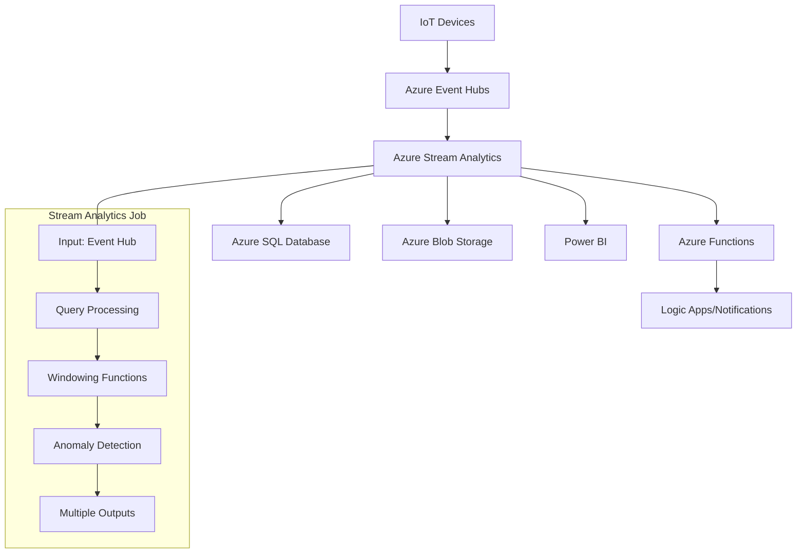

# 🌊 Azure Stream Analytics Real-Time Pipeline Tutorial

> __🏠 [Home](../../../README.md)__ | __📖 [Documentation](../../README.md)__ | __🎓 Tutorials__ | __🌊 Stream Analytics__


__Build a complete real-time data processing pipeline using Azure Stream Analytics. Process streaming IoT data, detect anomalies, and trigger alerts while learning advanced query patterns and optimization techniques.__

## 🎯 What You'll Build

By completing this tutorial, you'll create a __production-ready real-time analytics solution__ featuring:

- __📡 IoT Data Ingestion__ - Simulate and process sensor data streams
- __🔍 Real-time Analytics__ - Windowing functions, aggregations, and pattern detection
- __🚨 Anomaly Detection__ - Identify outliers and unusual patterns in streaming data
- __📊 Live Dashboards__ - Power BI integration for real-time visualization
- __⚡ Event-Driven Actions__ - Automated alerts and responses to critical events
- __🔄 Multi-Output Processing__ - Route data to different destinations based on conditions

## 🏗️ Architecture Overview



## 📚 Tutorial Modules

### __🚀 Module 1: Foundation Setup__ *(30 minutes)*

| Section | Focus | Duration |
|---------|-------|----------|
| [01. Environment Preparation](01-environment-setup.md) | Azure resources, Event Hubs setup | 15 mins |
| [02. Data Generator Setup](02-data-generator.md) | IoT simulator, sample data creation | 15 mins |

### __🔧 Module 2: Stream Analytics Job Configuration__ *(45 minutes)*

| Section | Focus | Duration |
|---------|-------|----------|
| [03. Creating Stream Analytics Job](03-job-creation.md) | Job setup, input/output configuration | 20 mins |
| [04. Query Development Basics](04-basic-queries.md) | Stream Analytics Query Language (SAQL) | 25 mins |

### __📊 Module 3: Advanced Analytics Patterns__ *(60 minutes)*

| Section | Focus | Duration |
|---------|-------|----------|
| [05. Windowing Functions](05-windowing-functions.md) | Tumbling, hopping, sliding windows | 20 mins |
| [06. Joins and Temporal Operations](06-joins-temporal.md) | Stream-to-stream and reference data joins | 20 mins |
| [07. Anomaly Detection](07-anomaly-detection.md) | Built-in ML functions, custom detection | 20 mins |

### __⚡ Module 4: Real-Time Dashboards__ *(30 minutes)*

| Section | Focus | Duration |
|---------|-------|----------|
| [08. Power BI Integration](08-powerbi-integration.md) | Direct streaming, real-time reports | 30 mins |

### __🔔 Module 5: Event-Driven Actions__ *(30 minutes)*

| Section | Focus | Duration |
|---------|-------|----------|
| [09. Azure Functions Integration](09-functions-integration.md) | Trigger functions, custom processing | 30 mins |

### __🎯 Module 6: Production Optimization__ *(45 minutes)*

| Section | Focus | Duration |
|---------|-------|----------|
| [10. Performance Tuning](10-performance-tuning.md) | Scaling, optimization, monitoring | 25 mins |
| [11. Error Handling & Resilience](11-error-handling.md) | Fault tolerance, dead letter handling | 20 mins |

## 🎮 Interactive Learning Features

### __🧪 Live Data Simulation__

- __IoT Device Simulator__: Generate realistic sensor data (temperature, humidity, pressure)
- __Anomaly Injection__: Introduce controlled anomalies to test detection algorithms
- __Variable Load Testing__: Simulate different data volumes and velocities
- __Real-time Monitoring__: Watch data flow through the pipeline in real-time

### __💻 Query Development Playground__

- __Interactive Query Editor__: Test Stream Analytics queries with live data
- __Query Templates__: Pre-built patterns for common scenarios
- __Performance Profiler__: Analyze query execution and resource utilization
- __Debugging Tools__: Step-through query execution and data transformation

### __📈 Scenario-Based Learning__

- __Smart Building__: Monitor HVAC systems and occupancy sensors
- __Manufacturing__: Track equipment performance and predict failures
- __Retail__: Analyze customer behavior and inventory in real-time
- __Financial__: Detect fraud and market anomalies

## 📋 Prerequisites

### __Required Knowledge__

- [ ] __SQL fundamentals__ - SELECT, WHERE, GROUP BY, JOIN operations
- [ ] __Basic Azure concepts__ - Resource groups, storage accounts, networking
- [ ] __JSON data format__ - Understanding structure and parsing
- [ ] __Event streaming concepts__ - Basic understanding of real-time data processing

### __Technical Requirements__

- [ ] __Azure Subscription__ with Event Hubs and Stream Analytics enabled
- [ ] __Power BI account__ (free tier sufficient for tutorials)
- [ ] __Visual Studio Code__ with Azure extensions
- [ ] __Azure CLI__ (latest version)
- [ ] __Python 3.8+__ (for data generation scripts)

### __Azure Services Used__

- __Azure Event Hubs__ - Data ingestion layer
- __Azure Stream Analytics__ - Real-time processing engine  
- __Azure SQL Database__ - Structured data storage
- __Azure Blob Storage__ - Raw data archival
- __Power BI__ - Real-time visualization
- __Azure Functions__ - Event-driven processing
- __Azure Logic Apps__ - Workflow automation

## 💰 Cost Estimation

### __Tutorial Execution Costs__

| Service | Estimated Cost | Usage Pattern |
|---------|----------------|---------------|
| __Event Hubs Standard__ | $10-20/month | 1M messages/month |
| __Stream Analytics__ | $75-150/month | 1 Streaming Unit |
| __SQL Database (Basic)__ | $5/month | Small database for results |
| __Blob Storage__ | $2-5/month | Archive storage |
| __Power BI Pro__ | $10/user/month | Real-time dashboards |
| __Azure Functions__ | $1-5/month | Consumption plan |

__Total Estimated Cost__: $100-200/month for production use, $10-30/month for tutorial/development

### __Cost Optimization Tips__

- __Use consumption-based pricing__ where available
- __Stop Stream Analytics jobs__ when not actively learning
- __Clean up Event Hub data__ regularly to avoid storage costs
- __Use shared Power BI workspace__ for multiple users

## 🚀 Quick Start Options

### __🎯 Complete Tutorial Path__ *(Recommended)*

Follow all modules in sequence for comprehensive real-time analytics mastery:

```powershell
# Clone tutorial repository and start environment setup
git clone https://github.com/your-org/stream-analytics-tutorial
cd stream-analytics-tutorial
.\scripts\setup-environment.ps1
```

### __🎮 Interactive Demo__ *(15 minutes)*

Quick hands-on experience with pre-configured streaming data:

```powershell
# Deploy demo environment with synthetic data
.\scripts\deploy-demo.ps1 -SubscriptionId "your-sub-id" -ResourceGroupName "stream-demo"
```

### __🔧 Specific Learning Paths__

Focus on areas of particular interest:

__Data Engineer Path__:

- Modules 1-3, 6 (Setup, job configuration, optimization)

__Data Scientist Path__:  

- Modules 3-4 (Advanced analytics, anomaly detection, visualization)

__Solutions Architect Path__:

- Modules 1, 3, 5-6 (Architecture, patterns, production considerations)

## 🎯 Learning Objectives

### __By Tutorial Completion, You Will:__

__🏗️ Architecture & Design__

- Design scalable real-time analytics architectures
- Choose appropriate streaming technologies for different scenarios  
- Implement fault-tolerant and resilient streaming pipelines
- Plan for high availability and disaster recovery

__💻 Technical Implementation__

- Write complex Stream Analytics queries using SAQL
- Implement various windowing functions for time-based analytics
- Build anomaly detection systems using built-in ML functions
- Integrate multiple data sources and output destinations

__📊 Analytics & Insights__

- Develop real-time dashboards and monitoring solutions
- Implement alerting and automated response systems
- Analyze streaming data patterns and trends
- Build predictive models for streaming data

__🔧 Operations & Performance__

- Monitor and optimize Stream Analytics job performance
- Implement error handling and data quality checks
- Scale streaming solutions for high-throughput scenarios
- Troubleshoot common streaming analytics issues

## 📖 Real-World Scenarios

### __🏢 Smart Building Management__

Monitor building sensors to optimize energy usage and occupancy:

```sql
-- Real-time occupancy tracking with environmental controls
SELECT 
    BuildingId,
    FloorNumber,
    COUNT(*) as OccupancyCount,
    AVG(Temperature) as AvgTemp,
    AVG(Humidity) as AvgHumidity,
    System.Timestamp AS WindowEnd
FROM SensorData TIMESTAMP BY EventTime
WHERE SensorType = 'Occupancy' OR SensorType = 'Environmental'
GROUP BY BuildingId, FloorNumber, TumblingWindow(minute, 5)
HAVING COUNT(*) > 10 OR AVG(Temperature) > 75
```

### __🏭 Predictive Maintenance__

Detect equipment anomalies before failures occur:

```sql
-- Equipment health monitoring with anomaly detection
SELECT
    EquipmentId,
    Vibration,
    Temperature,
    AnomalyDetection_SpikeAndDip(Vibration, 95, 120, 'spikesanddips') AS VibrationAnomaly,
    System.Timestamp AS ProcessingTime
FROM EquipmentTelemetry TIMESTAMP BY Timestamp
WHERE AnomalyDetection_SpikeAndDip(Vibration, 95, 120, 'spikesanddips') IS NOT NULL
```

### __💳 Fraud Detection__

Identify suspicious transaction patterns in real-time:

```sql
-- Real-time fraud detection with geographic analysis
SELECT 
    t1.UserId,
    t1.TransactionAmount,
    t1.Location as FirstLocation,
    t2.Location as SecondLocation,
    DATEDIFF(minute, t1.Timestamp, t2.Timestamp) as TimeDifference
FROM Transactions t1 TIMESTAMP BY Timestamp
JOIN Transactions t2 TIMESTAMP BY Timestamp
    ON t1.UserId = t2.UserId
    AND DATEDIFF(minute, t1, t2) BETWEEN 1 AND 30
WHERE t1.Location != t2.Location 
    AND geo.distance(t1.Location, t2.Location) > 100
```

## 💡 Advanced Patterns You'll Master

### __🔄 Complex Event Processing__

- __Pattern Recognition__: Detect sequences of events over time
- __Correlation Analysis__: Find relationships between different event streams  
- __State Management__: Maintain context across multiple events
- __Temporal Logic__: Handle out-of-order and late-arriving events

### __📊 Advanced Analytics Functions__

- __Machine Learning Integration__: Built-in anomaly detection and classification
- __Geospatial Operations__: Location-based analytics and geofencing
- __Array and Record Operations__: Process complex nested data structures
- __User-Defined Functions__: Extend functionality with custom JavaScript

### __🚀 Performance Optimization__

- __Parallelization Strategies__: Optimize partition keys for maximum throughput
- __Memory Management__: Efficient query patterns for large datasets
- __Latency Minimization__: Techniques for ultra-low latency processing
- __Cost Optimization__: Balance performance with operational costs

## 🔧 Troubleshooting Guide

### __Common Issues & Solutions__

__Data Not Flowing__:

```powershell
# Check Event Hub connectivity
az eventhubs eventhub show --resource-group "your-rg" --namespace-name "your-namespace" --name "your-eventhub"

# Verify Stream Analytics job status
az stream-analytics job show --resource-group "your-rg" --name "your-job"
```

__Query Errors__:

```sql
-- Test query syntax with sample data
WITH SampleData AS (
    SELECT 'test-device' as DeviceId, 25.5 as Temperature, System.Timestamp as EventTime
)
SELECT * FROM SampleData
```

__Performance Issues__:

```powershell
# Monitor streaming unit utilization
az stream-analytics job show --resource-group "your-rg" --name "your-job" --query "transformation.streamingUnits"
```

## 🌟 Success Stories

> __"The real-time anomaly detection tutorial helped us prevent three major equipment failures in our manufacturing plant. The ROI was immediate."__ - *James, Operations Manager*
>
> __"Building the fraud detection pipeline taught me advanced SQL patterns I use daily. The hands-on approach made complex concepts clear."__ - *Maria, Data Engineer*
>
> __"The Power BI integration was game-changing for our operations team. Real-time dashboards transformed our incident response time."__ - *David, IT Director*

## 📞 Support & Community

### __Getting Help__

- __📖 Official Documentation__: [Stream Analytics Documentation](https://docs.microsoft.com/azure/stream-analytics/)
- __💬 Community Forum__: [Microsoft Q&A](https://docs.microsoft.com/answers/topics/azure-stream-analytics.html)
- __🎬 Video Tutorials__: [YouTube Playlist](https://youtube.com/playlist?list=stream-analytics-tutorials)
- __📧 Direct Support__: <stream-analytics-tutorial@your-org.com>

### __Best Practices Resources__

- [Stream Analytics Best Practices Guide](https://docs.microsoft.com/azure/stream-analytics/stream-analytics-streaming-unit-consumption)
- [Query Optimization Patterns](https://docs.microsoft.com/azure/stream-analytics/stream-analytics-streaming-unit-consumption)
- [Production Deployment Guide](https://docs.microsoft.com/azure/stream-analytics/stream-analytics-tools-for-visual-studio)

---

__Ready to dive into real-time analytics?__

🚀 __[Start with Environment Setup →](01-environment-setup.md)__

---

*Tutorial Series Version: 1.0*  
*Last Updated: January 2025*  
*Estimated Completion: 2-3 hours*
