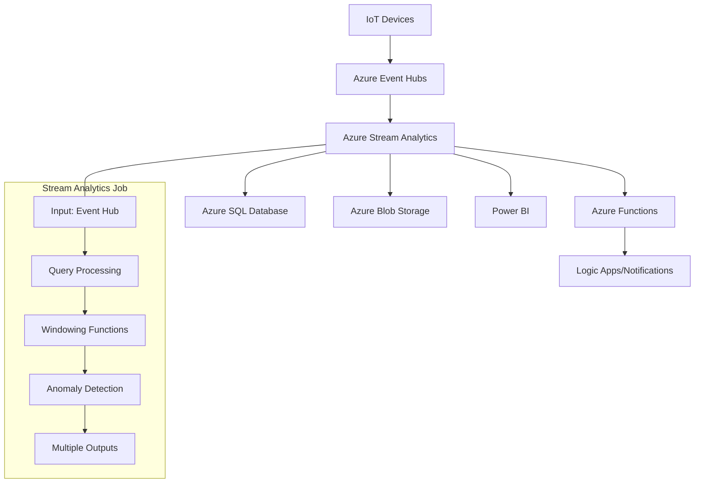

# 🌊 Azure Stream Analytics Real-Time Pipeline Tutorial

> **🏠 [Home](../../../README.md)** | **📖 [Documentation](../../README.md)** | **🎓 [Tutorials](../README.md)** | **🌊 Stream Analytics**


**Build a complete real-time data processing pipeline using Azure Stream Analytics. Process streaming IoT data, detect anomalies, and trigger alerts while learning advanced query patterns and optimization techniques.**

## 🎯 What You'll Build

By completing this tutorial, you'll create a **production-ready real-time analytics solution** featuring:

- **📡 IoT Data Ingestion** - Simulate and process sensor data streams
- **🔍 Real-time Analytics** - Windowing functions, aggregations, and pattern detection
- **🚨 Anomaly Detection** - Identify outliers and unusual patterns in streaming data
- **📊 Live Dashboards** - Power BI integration for real-time visualization
- **⚡ Event-Driven Actions** - Automated alerts and responses to critical events
- **🔄 Multi-Output Processing** - Route data to different destinations based on conditions

## 🏗️ Architecture Overview



## 📚 Tutorial Modules

### **🚀 Module 1: Foundation Setup** *(30 minutes)*
| Section | Focus | Duration |
|---------|-------|----------|
| [01. Environment Preparation](01-environment-setup.md) | Azure resources, Event Hubs setup | 15 mins |
| [02. Data Generator Setup](02-data-generator.md) | IoT simulator, sample data creation | 15 mins |

### **🔧 Module 2: Stream Analytics Job Configuration** *(45 minutes)*
| Section | Focus | Duration |
|---------|-------|----------|
| [03. Creating Stream Analytics Job](03-job-creation.md) | Job setup, input/output configuration | 20 mins |
| [04. Query Development Basics](04-basic-queries.md) | Stream Analytics Query Language (SAQL) | 25 mins |

### **📊 Module 3: Advanced Analytics Patterns** *(60 minutes)*
| Section | Focus | Duration |
|---------|-------|----------|
| [05. Windowing Functions](05-windowing-functions.md) | Tumbling, hopping, sliding windows | 20 mins |
| [06. Joins and Temporal Operations](06-joins-temporal.md) | Stream-to-stream and reference data joins | 20 mins |
| [07. Anomaly Detection](07-anomaly-detection.md) | Built-in ML functions, custom detection | 20 mins |

### **⚡ Module 4: Real-Time Dashboards** *(30 minutes)*
| Section | Focus | Duration |
|---------|-------|----------|
| [08. Power BI Integration](08-powerbi-integration.md) | Direct streaming, real-time reports | 30 mins |

### **🔔 Module 5: Event-Driven Actions** *(30 minutes)*
| Section | Focus | Duration |
|---------|-------|----------|
| [09. Azure Functions Integration](09-functions-integration.md) | Trigger functions, custom processing | 30 mins |

### **🎯 Module 6: Production Optimization** *(45 minutes)*
| Section | Focus | Duration |
|---------|-------|----------|
| [10. Performance Tuning](10-performance-tuning.md) | Scaling, optimization, monitoring | 25 mins |
| [11. Error Handling & Resilience](11-error-handling.md) | Fault tolerance, dead letter handling | 20 mins |

## 🎮 Interactive Learning Features

### **🧪 Live Data Simulation**
- **IoT Device Simulator**: Generate realistic sensor data (temperature, humidity, pressure)
- **Anomaly Injection**: Introduce controlled anomalies to test detection algorithms
- **Variable Load Testing**: Simulate different data volumes and velocities
- **Real-time Monitoring**: Watch data flow through the pipeline in real-time

### **💻 Query Development Playground**
- **Interactive Query Editor**: Test Stream Analytics queries with live data
- **Query Templates**: Pre-built patterns for common scenarios
- **Performance Profiler**: Analyze query execution and resource utilization
- **Debugging Tools**: Step-through query execution and data transformation

### **📈 Scenario-Based Learning**
- **Smart Building**: Monitor HVAC systems and occupancy sensors
- **Manufacturing**: Track equipment performance and predict failures
- **Retail**: Analyze customer behavior and inventory in real-time
- **Financial**: Detect fraud and market anomalies

## 📋 Prerequisites

### **Required Knowledge**
- [ ] **SQL fundamentals** - SELECT, WHERE, GROUP BY, JOIN operations
- [ ] **Basic Azure concepts** - Resource groups, storage accounts, networking
- [ ] **JSON data format** - Understanding structure and parsing
- [ ] **Event streaming concepts** - Basic understanding of real-time data processing

### **Technical Requirements**
- [ ] **Azure Subscription** with Event Hubs and Stream Analytics enabled
- [ ] **Power BI account** (free tier sufficient for tutorials)
- [ ] **Visual Studio Code** with Azure extensions
- [ ] **Azure CLI** (latest version)
- [ ] **Python 3.8+** (for data generation scripts)

### **Azure Services Used**
- **Azure Event Hubs** - Data ingestion layer
- **Azure Stream Analytics** - Real-time processing engine  
- **Azure SQL Database** - Structured data storage
- **Azure Blob Storage** - Raw data archival
- **Power BI** - Real-time visualization
- **Azure Functions** - Event-driven processing
- **Azure Logic Apps** - Workflow automation

## 💰 Cost Estimation

### **Tutorial Execution Costs**
| Service | Estimated Cost | Usage Pattern |
|---------|----------------|---------------|
| **Event Hubs Standard** | $10-20/month | 1M messages/month |
| **Stream Analytics** | $75-150/month | 1 Streaming Unit |
| **SQL Database (Basic)** | $5/month | Small database for results |
| **Blob Storage** | $2-5/month | Archive storage |
| **Power BI Pro** | $10/user/month | Real-time dashboards |
| **Azure Functions** | $1-5/month | Consumption plan |

**Total Estimated Cost**: $100-200/month for production use, $10-30/month for tutorial/development

### **Cost Optimization Tips**
- **Use consumption-based pricing** where available
- **Stop Stream Analytics jobs** when not actively learning
- **Clean up Event Hub data** regularly to avoid storage costs
- **Use shared Power BI workspace** for multiple users

## 🚀 Quick Start Options

### **🎯 Complete Tutorial Path** *(Recommended)*
Follow all modules in sequence for comprehensive real-time analytics mastery:
```powershell
# Clone tutorial repository and start environment setup
git clone https://github.com/your-org/stream-analytics-tutorial
cd stream-analytics-tutorial
.\scripts\setup-environment.ps1
```

### **🎮 Interactive Demo** *(15 minutes)*
Quick hands-on experience with pre-configured streaming data:
```powershell
# Deploy demo environment with synthetic data
.\scripts\deploy-demo.ps1 -SubscriptionId "your-sub-id" -ResourceGroupName "stream-demo"
```

### **🔧 Specific Learning Paths**
Focus on areas of particular interest:

**Data Engineer Path**:
- Modules 1-3, 6 (Setup, job configuration, optimization)

**Data Scientist Path**:  
- Modules 3-4 (Advanced analytics, anomaly detection, visualization)

**Solutions Architect Path**:
- Modules 1, 3, 5-6 (Architecture, patterns, production considerations)

## 🎯 Learning Objectives

### **By Tutorial Completion, You Will:**

**🏗️ Architecture & Design**
- Design scalable real-time analytics architectures
- Choose appropriate streaming technologies for different scenarios  
- Implement fault-tolerant and resilient streaming pipelines
- Plan for high availability and disaster recovery

**💻 Technical Implementation**
- Write complex Stream Analytics queries using SAQL
- Implement various windowing functions for time-based analytics
- Build anomaly detection systems using built-in ML functions
- Integrate multiple data sources and output destinations

**📊 Analytics & Insights**
- Develop real-time dashboards and monitoring solutions
- Implement alerting and automated response systems
- Analyze streaming data patterns and trends
- Build predictive models for streaming data

**🔧 Operations & Performance**
- Monitor and optimize Stream Analytics job performance
- Implement error handling and data quality checks
- Scale streaming solutions for high-throughput scenarios
- Troubleshoot common streaming analytics issues

## 📖 Real-World Scenarios

### **🏢 Smart Building Management**
Monitor building sensors to optimize energy usage and occupancy:

```sql
-- Real-time occupancy tracking with environmental controls
SELECT 
    BuildingId,
    FloorNumber,
    COUNT(*) as OccupancyCount,
    AVG(Temperature) as AvgTemp,
    AVG(Humidity) as AvgHumidity,
    System.Timestamp AS WindowEnd
FROM SensorData TIMESTAMP BY EventTime
WHERE SensorType = 'Occupancy' OR SensorType = 'Environmental'
GROUP BY BuildingId, FloorNumber, TumblingWindow(minute, 5)
HAVING COUNT(*) > 10 OR AVG(Temperature) > 75
```

### **🏭 Predictive Maintenance**
Detect equipment anomalies before failures occur:

```sql
-- Equipment health monitoring with anomaly detection
SELECT
    EquipmentId,
    Vibration,
    Temperature,
    AnomalyDetection_SpikeAndDip(Vibration, 95, 120, 'spikesanddips') AS VibrationAnomaly,
    System.Timestamp AS ProcessingTime
FROM EquipmentTelemetry TIMESTAMP BY Timestamp
WHERE AnomalyDetection_SpikeAndDip(Vibration, 95, 120, 'spikesanddips') IS NOT NULL
```

### **💳 Fraud Detection**
Identify suspicious transaction patterns in real-time:

```sql
-- Real-time fraud detection with geographic analysis
SELECT 
    t1.UserId,
    t1.TransactionAmount,
    t1.Location as FirstLocation,
    t2.Location as SecondLocation,
    DATEDIFF(minute, t1.Timestamp, t2.Timestamp) as TimeDifference
FROM Transactions t1 TIMESTAMP BY Timestamp
JOIN Transactions t2 TIMESTAMP BY Timestamp
    ON t1.UserId = t2.UserId
    AND DATEDIFF(minute, t1, t2) BETWEEN 1 AND 30
WHERE t1.Location != t2.Location 
    AND geo.distance(t1.Location, t2.Location) > 100
```

## 💡 Advanced Patterns You'll Master

### **🔄 Complex Event Processing**
- **Pattern Recognition**: Detect sequences of events over time
- **Correlation Analysis**: Find relationships between different event streams  
- **State Management**: Maintain context across multiple events
- **Temporal Logic**: Handle out-of-order and late-arriving events

### **📊 Advanced Analytics Functions**
- **Machine Learning Integration**: Built-in anomaly detection and classification
- **Geospatial Operations**: Location-based analytics and geofencing
- **Array and Record Operations**: Process complex nested data structures
- **User-Defined Functions**: Extend functionality with custom JavaScript

### **🚀 Performance Optimization**
- **Parallelization Strategies**: Optimize partition keys for maximum throughput
- **Memory Management**: Efficient query patterns for large datasets
- **Latency Minimization**: Techniques for ultra-low latency processing
- **Cost Optimization**: Balance performance with operational costs

## 🔧 Troubleshooting Guide

### **Common Issues & Solutions**

**Data Not Flowing**:
```powershell
# Check Event Hub connectivity
az eventhubs eventhub show --resource-group "your-rg" --namespace-name "your-namespace" --name "your-eventhub"

# Verify Stream Analytics job status
az stream-analytics job show --resource-group "your-rg" --name "your-job"
```

**Query Errors**:
```sql
-- Test query syntax with sample data
WITH SampleData AS (
    SELECT 'test-device' as DeviceId, 25.5 as Temperature, System.Timestamp as EventTime
)
SELECT * FROM SampleData
```

**Performance Issues**:
```powershell
# Monitor streaming unit utilization
az stream-analytics job show --resource-group "your-rg" --name "your-job" --query "transformation.streamingUnits"
```

## 🌟 Success Stories

> **"The real-time anomaly detection tutorial helped us prevent three major equipment failures in our manufacturing plant. The ROI was immediate."** - *James, Operations Manager*

> **"Building the fraud detection pipeline taught me advanced SQL patterns I use daily. The hands-on approach made complex concepts clear."** - *Maria, Data Engineer*  

> **"The Power BI integration was game-changing for our operations team. Real-time dashboards transformed our incident response time."** - *David, IT Director*

## 📞 Support & Community

### **Getting Help**
- **📖 Official Documentation**: [Stream Analytics Documentation](https://docs.microsoft.com/azure/stream-analytics/)
- **💬 Community Forum**: [Microsoft Q&A](https://docs.microsoft.com/answers/topics/azure-stream-analytics.html)
- **🎬 Video Tutorials**: [YouTube Playlist](https://youtube.com/playlist?list=stream-analytics-tutorials)
- **📧 Direct Support**: stream-analytics-tutorial@your-org.com

### **Best Practices Resources**
- [Stream Analytics Best Practices Guide](https://docs.microsoft.com/azure/stream-analytics/stream-analytics-streaming-unit-consumption)
- [Query Optimization Patterns](https://docs.microsoft.com/azure/stream-analytics/stream-analytics-streaming-unit-consumption)
- [Production Deployment Guide](https://docs.microsoft.com/azure/stream-analytics/stream-analytics-tools-for-visual-studio)

---

**Ready to dive into real-time analytics?**

🚀 **[Start with Environment Setup →](01-environment-setup.md)**

---

*Tutorial Series Version: 1.0*  
*Last Updated: January 2025*  
*Estimated Completion: 2-3 hours*