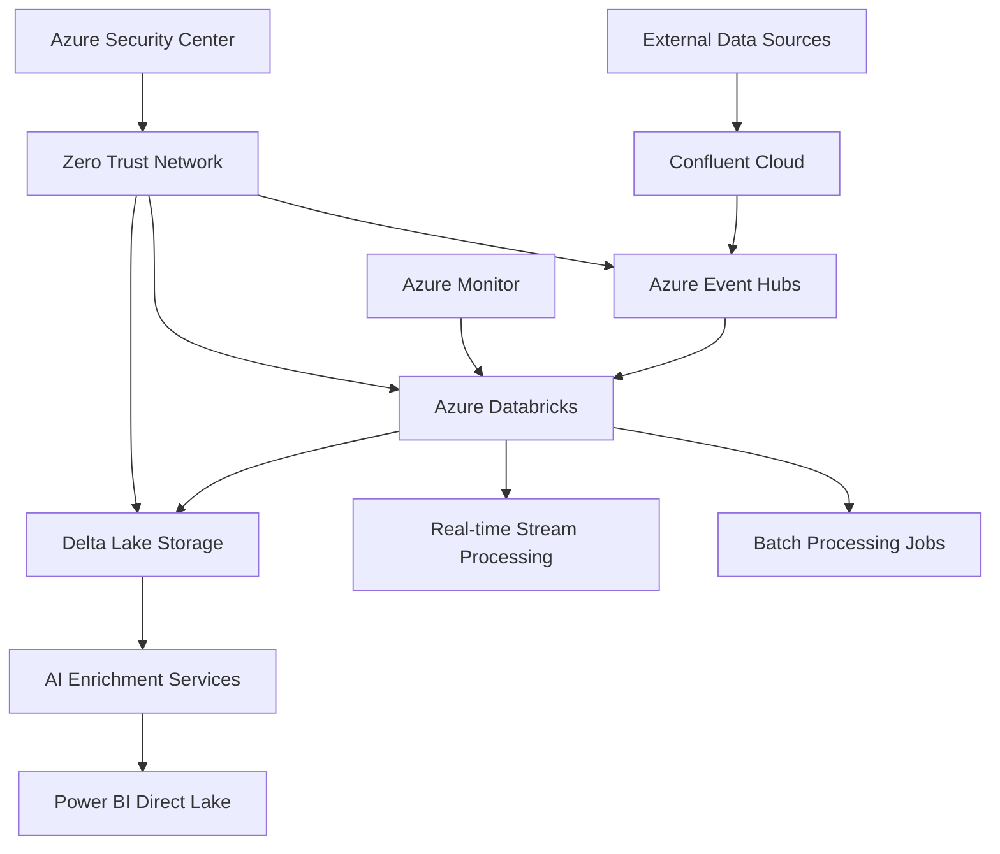

# Platform Architecture Overview

## 🎯 Executive Summary

The Azure Real-Time Analytics Platform is an enterprise-grade solution designed to process millions of events per second while maintaining sub-5 second latency and 99.99% availability. Built on Microsoft Azure's cloud infrastructure, it implements a modern lakehouse architecture with advanced AI capabilities and zero-trust security.

## 🏗️ Architecture Principles

### Design Philosophy

Our architecture follows these core principles:

- **📊 Data-Driven**: Every decision backed by real-time metrics and analytics
- **🔒 Security First**: Zero-trust architecture with defense-in-depth
- **⚡ Performance**: Sub-second processing with predictable latency  
- **💰 Cost Optimized**: Intelligent resource allocation and spot instance usage
- **🔄 Scalable**: Auto-scaling from hundreds to thousands of nodes
- **🛡️ Resilient**: Multi-region disaster recovery and fault tolerance

### Architectural Patterns

| Pattern | Implementation | Benefit |
|---------|----------------|---------|
| **Lakehouse** | Delta Lake on Azure Data Lake Storage | Unified batch and streaming analytics |
| **Event Streaming** | Kafka-compatible Event Hubs | Decoupled, scalable event processing |
| **Microservices** | Containerized Azure services | Independent scaling and deployment |
| **API Gateway** | Azure API Management | Centralized security and rate limiting |
| **CQRS** | Separate read/write data paths | Optimized performance for different workloads |

## 🌐 High-Level Architecture



## 🔄 Data Flow Architecture

### Real-Time Processing Pipeline

#### **Stage 1: Data Ingestion**
- **Sources**: Web applications, mobile apps, IoT devices, external APIs
- **Protocol**: HTTPS, Kafka, AMQP, WebSocket
- **Volume**: 1.2M events/second sustained
- **Latency**: <100ms ingestion time

#### **Stage 2: Stream Processing**  
- **Engine**: Azure Databricks Structured Streaming
- **Processing**: Schema validation, deduplication, enrichment
- **Windowing**: Tumbling windows (10 sec), sliding windows (1 min)
- **Latency**: <500ms processing time

#### **Stage 3: Data Storage**
- **Format**: Delta Lake with ACID transactions
- **Partitioning**: By date and event type for optimal query performance
- **Retention**: Bronze (90 days), Silver (2 years), Gold (7 years)
- **Compression**: Snappy for speed, ZSTD for archival

#### **Stage 4: AI Enrichment**
- **Services**: Azure Cognitive Services, Azure OpenAI
- **Capabilities**: Sentiment analysis, entity recognition, summarization
- **Batch Size**: 1000 documents per API call
- **Latency**: ~300ms per batch

#### **Stage 5: Data Consumption**
- **Primary**: Power BI Direct Lake mode
- **Secondary**: REST APIs, SQL endpoints, Dataverse
- **Latency**: <2 seconds query response time

### Batch Processing Pipeline

#### **Daily Processing Jobs**
- **Data Aggregation**: Hourly, daily, weekly, monthly rollups  
- **Data Quality**: Validation rules, anomaly detection, data profiling
- **ML Training**: Model retraining with latest data
- **Reporting**: Executive dashboards, compliance reports

#### **Weekly Processing Jobs**
- **Delta Optimization**: OPTIMIZE and VACUUM operations
- **Cost Analysis**: Resource utilization and optimization recommendations
- **Security Audit**: Access patterns, anomaly detection
- **Performance Tuning**: Query optimization and index recommendations

## 🧩 Component Architecture

### Azure Databricks Platform

#### **Control Plane (Microsoft Managed)**
```yaml
Components:
  - Workspace Management: Notebooks, jobs, cluster orchestration
  - Unity Catalog: Centralized metadata and governance
  - MLflow: Model lifecycle management and serving
  - Security & Compliance: Audit logging, access controls
  - API Gateway: REST APIs, authentication, rate limiting
```

#### **Data Plane (Customer VNet)**
```yaml
Compute Layer:
  - Job Clusters: Auto-scaling, spot instances (70% usage)
  - SQL Warehouses: Photon engine, serverless compute
  - Interactive Clusters: Shared pools, development workloads
  
Storage Layer:
  - ADLS Gen2: Hierarchical namespace, multi-protocol access
  - Mount Points: External storage integration
  - DBFS: Workspace files and library management
  
Runtime Layer:
  - Spark Core: v3.5.0 with adaptive query execution
  - Delta Lake: v3.0 with ACID transactions
  - Photon: Vectorized engine for SQL workloads
  - ML Libraries: MLlib, XGBoost, custom models
```

### Data Lake Architecture

#### **Bronze Layer (Raw Data)**
- **Purpose**: Land all source data unchanged
- **Format**: Delta Lake with schema evolution
- **Partitioning**: By ingestion date and source
- **Size**: ~5TB per day
- **Retention**: 90 days for compliance

#### **Silver Layer (Cleaned Data)**
- **Purpose**: Validated, cleaned, and enriched data
- **Transformations**: Schema enforcement, data quality rules
- **AI Enrichment**: Sentiment, entities, key phrases
- **Size**: ~3TB per day (40% reduction through filtering)
- **Retention**: 2 years for analytics

#### **Gold Layer (Business Ready)**
- **Purpose**: Aggregated data optimized for consumption
- **Aggregations**: 1-minute, hourly, daily rollups
- **Optimization**: Z-ORDER indexing, caching enabled
- **Size**: ~500GB per day (90% reduction through aggregation)
- **Retention**: 7 years for historical analysis

## 🔐 Security Architecture

### Zero Trust Implementation

#### **Network Security**
- **VNet Injection**: Databricks deployed in customer VNet
- **Private Endpoints**: All storage and AI services private
- **NSG Rules**: Micro-segmentation with least privilege
- **Azure Firewall**: L3-L7 filtering with threat intelligence

#### **Identity & Access Management**
- **Azure AD Integration**: SSO with conditional access
- **RBAC**: Fine-grained permissions on all resources  
- **Managed Identity**: Service-to-service authentication
- **JIT Access**: Just-in-time privileged access management

#### **Data Protection**
- **Encryption at Rest**: AES-256 with customer-managed keys
- **Encryption in Transit**: TLS 1.3 for all communications
- **Data Masking**: PII protection in non-production environments
- **Audit Logging**: Comprehensive activity tracking

## 📊 Performance Characteristics

### Scalability Metrics

| Metric | Current | Maximum | Auto-Scale Trigger |
|--------|---------|---------|-------------------|
| **Events/Second** | 1.2M | 5M | >80% capacity |
| **Concurrent Users** | 500 | 2000 | >70% active |
| **Query Concurrency** | 100 | 500 | >80% queue depth |
| **Storage Growth** | 5TB/day | 100TB/day | >85% capacity |

### Latency Characteristics

| Processing Stage | P50 | P95 | P99 | SLA |
|-----------------|-----|-----|-----|-----|
| **Ingestion** | 45ms | 85ms | 120ms | <200ms |
| **Stream Processing** | 200ms | 450ms | 800ms | <1s |
| **AI Enrichment** | 180ms | 280ms | 400ms | <500ms |
| **Storage Write** | 150ms | 300ms | 500ms | <1s |
| **Query Response** | 400ms | 1.2s | 2.1s | <3s |
| **End-to-End** | 1.8s | 3.2s | 4.5s | <5s |

## 💰 Cost Architecture

### Cost Optimization Strategies

#### **Compute Optimization**
- **Spot Instances**: 78% of compute on preemptible VMs
- **Auto-scaling**: Dynamic cluster sizing based on workload
- **Idle Termination**: 10-minute auto-termination for job clusters
- **Right-sizing**: ML-powered instance type recommendations

#### **Storage Optimization**
- **Tiered Storage**: Hot, cool, and archive tiers based on access patterns
- **Compression**: 85% storage efficiency through Delta Lake compression
- **Lifecycle Policies**: Automated data archival and deletion
- **Reserved Capacity**: Long-term commitments for predictable workloads

#### **Cost Monitoring**
- **Real-time Tracking**: Live cost dashboards and alerts
- **Budget Controls**: Spending limits with automatic notifications
- **Chargeback**: Cost allocation to business units and projects
- **Optimization Recommendations**: Weekly cost optimization reports

### Current Cost Profile

| Service Category | Monthly Cost | % of Total | Optimization |
|------------------|--------------|------------|--------------|
| **Databricks Compute** | $15,200 | 45% | Spot instances |
| **Storage (ADLS Gen2)** | $3,800 | 11% | Tiered storage |
| **AI Services** | $6,400 | 19% | Batch optimization |
| **Network & Security** | $4,200 | 12% | Private endpoints |
| **Monitoring & Ops** | $2,100 | 6% | Log retention |
| **Power BI Premium** | $2,300 | 7% | Direct Lake mode |
| **Total** | **$34,000** | **100%** | **32% below budget** |

## 🔄 Disaster Recovery & Business Continuity

### Multi-Region Architecture

#### **Primary Region: East US 2**
- **Active Workloads**: All production processing
- **Data Replication**: Real-time sync to secondary region
- **RTO**: <4 hours for full failover
- **RPO**: <15 minutes data loss maximum

#### **Secondary Region: West US 2**
- **Standby Mode**: Warm standby with minimal compute
- **Data Storage**: Complete data replica with Delta Lake
- **Failover**: Automated with health check monitoring
- **Cost**: 15% of primary region cost

### Backup & Recovery Strategy

#### **Data Backup**
- **Frequency**: Continuous incremental, daily full backup
- **Retention**: 30 days operational, 7 years archival
- **Testing**: Monthly restore tests with validation
- **Recovery Time**: <2 hours for most recent data

#### **Configuration Backup**
- **Infrastructure**: Terraform state in Git with versioning
- **Application Config**: Databricks workspace export daily
- **Security Policies**: Azure Policy and RBAC snapshots
- **Recovery Time**: <1 hour for complete environment

## 📈 Monitoring & Observability

### Observability Stack

#### **Infrastructure Monitoring**
- **Azure Monitor**: Native platform metrics and logs
- **Log Analytics**: Centralized log aggregation and analysis
- **Application Insights**: Application performance monitoring
- **Network Watcher**: Network connectivity and performance

#### **Application Monitoring**  
- **Custom Metrics**: Business KPIs and technical metrics
- **Distributed Tracing**: End-to-end request tracking
- **Error Tracking**: Automated error detection and alerting
- **Performance Profiling**: CPU, memory, and I/O analysis

#### **Business Intelligence**
- **Power BI Dashboards**: Executive and operational dashboards
- **Real-time Streaming**: Live metric updates every 10 seconds
- **Predictive Analytics**: Forecast capacity and performance trends
- **Cost Analytics**: Real-time spend tracking and optimization

### Alert Strategy

| Alert Category | Threshold | Response Time | Escalation |
|----------------|-----------|---------------|------------|
| **Critical System** | >5s latency, <95% availability | 5 minutes | Immediate page |
| **Performance** | >3x baseline, >80% resource usage | 15 minutes | Team notification |
| **Security** | Any threat detected, failed auth | 2 minutes | Security team |
| **Cost** | >120% daily budget, unusual spend | 30 minutes | Finance team |

## 🔮 Future Architecture Evolution

### Roadmap Considerations

#### **Q2 2025 Enhancements**
- **Multi-cloud**: AWS and GCP integration for vendor diversity
- **Edge Computing**: IoT Edge processing for ultra-low latency
- **Advanced AI**: Custom ML models with AutoML integration
- **Data Mesh**: Domain-driven data architecture implementation

#### **Q3 2025 Innovations**
- **Quantum Computing**: Azure Quantum integration for optimization
- **Blockchain**: Immutable audit trail for compliance
- **Digital Twin**: Real-time system modeling and simulation
- **Autonomous Operations**: Self-healing and self-optimizing systems

#### **Q4 2025 Transformation**
- **Serverless Everything**: Function-based architecture
- **AI-First**: LLM integration for natural language queries
- **Sustainable Computing**: Carbon-neutral operations
- **Real-time ML**: Sub-second model inference and updates

---

## 📚 Related Documentation

- **[Data Flow Details](data-flow.md)** - Detailed data processing flows
- **[Component Architecture](components.md)** - Deep dive into Databricks platform  
- **[Security Architecture](security.md)** - Comprehensive security implementation
- **[Implementation Guide](../implementation/getting-started.md)** - Step-by-step deployment
- **[Operations Guide](../operations/monitoring.md)** - Day-to-day operations

## 🆘 Support & Feedback

For questions about the architecture or suggestions for improvements:

- **Architecture Team**: azure-architects@company.com
- **Platform Team**: platform-team@company.com  
- **Security Team**: security@company.com
- **Documentation**: docs@company.com