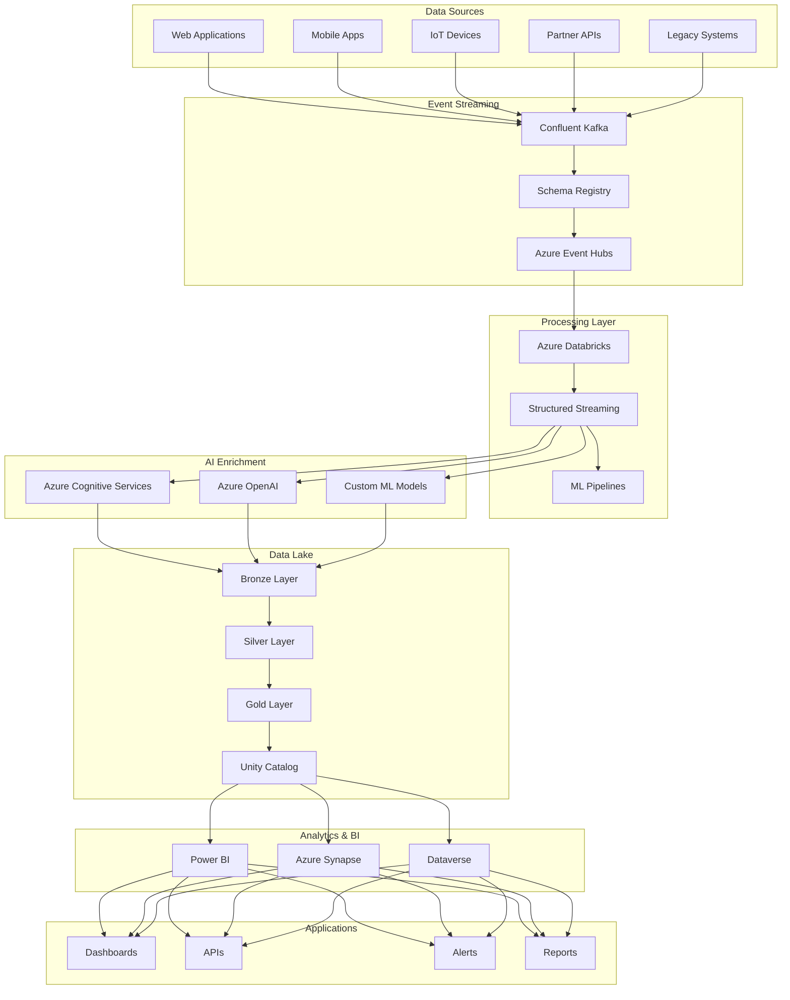
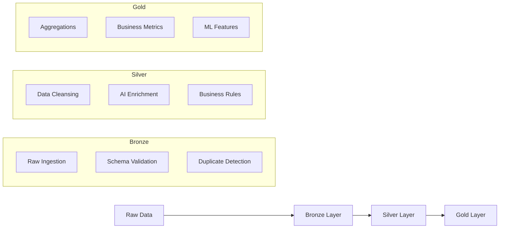
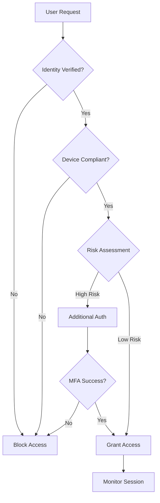
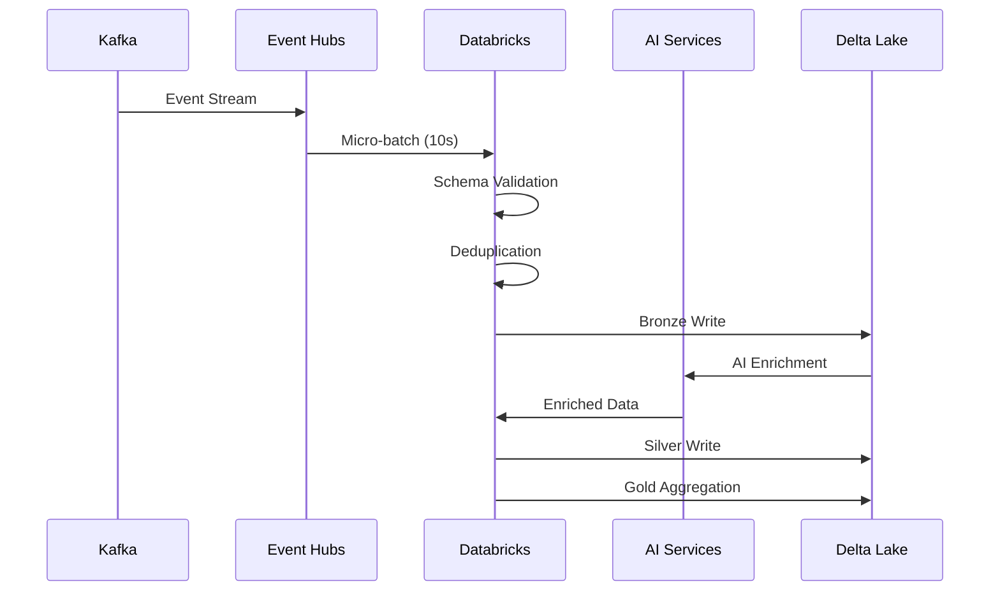
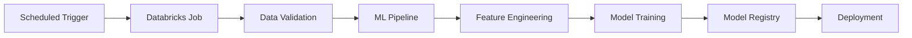

# Architecture Overview

> Comprehensive overview of the Azure Real-Time Analytics Platform architecture, design principles, and key capabilities.

## 🎯 Executive Summary

The Azure Real-Time Analytics Platform is an enterprise-grade, cloud-native solution designed to process and analyze massive volumes of streaming data in real-time. Built on Azure's robust infrastructure, the platform delivers **sub-5-second end-to-end latency** while processing over **1 million events per second** with **99.99% availability**.

## 🏗️ Architectural Principles

### Design Philosophy

Our architecture follows key principles that ensure scalability, reliability, and maintainability:

#### 1. **Cloud-Native First**
- **Serverless where possible** - Reduce operational overhead
- **Managed services** - Leverage Azure's expertise and SLAs
- **Auto-scaling** - Handle dynamic workloads efficiently
- **Pay-per-use** - Optimize costs through consumption-based pricing

#### 2. **Event-Driven Architecture**
- **Asynchronous processing** - Decouple components for resilience
- **Event sourcing** - Maintain complete audit trail
- **Reactive systems** - Respond to changes in real-time
- **Message durability** - Ensure no data loss

#### 3. **Data Mesh Principles**
- **Domain-oriented** - Organize data by business domains
- **Self-serve infrastructure** - Enable team autonomy
- **Federated governance** - Consistent standards across domains
- **Data as a product** - Treat data with product thinking

#### 4. **Zero Trust Security**
- **Never trust, always verify** - Authenticate every access
- **Least privilege access** - Minimum required permissions
- **Assume breach** - Design for compromise scenarios
- **Continuous monitoring** - Real-time security assessment

## 🔄 High-Level Architecture



## 🏭 Core Components

### 1. **Event Ingestion Layer**

#### Confluent Kafka Cloud
- **Purpose**: Primary event streaming platform
- **Capacity**: 10+ topics, 1M+ events/second
- **Features**: Schema evolution, exactly-once semantics
- **SLA**: 99.99% availability

#### Azure Event Hubs
- **Purpose**: Azure-native event ingestion
- **Integration**: Kafka protocol compatibility
- **Scaling**: Auto-inflate enabled
- **Security**: Private endpoints, managed identity

### 2. **Stream Processing Layer**

#### Azure Databricks
- **Runtime**: Databricks Runtime 13.3 LTS
- **Engine**: Apache Spark 3.5.0 with Photon
- **Processing**: Structured Streaming with micro-batches
- **Features**: Delta Live Tables, Unity Catalog

#### Processing Capabilities
```python
# Example streaming configuration
spark.conf.set("spark.sql.streaming.checkpointLocation", "/checkpoints/")
spark.conf.set("spark.sql.streaming.schemaInference", "true")
spark.conf.set("spark.sql.streaming.forceDeleteTempCheckpointLocation", "true")

# Stream processing with watermarking
df = (spark
  .readStream
  .format("kafka")
  .option("kafka.bootstrap.servers", kafka_servers)
  .option("subscribe", topics)
  .load()
  .withWatermark("timestamp", "1 minute")
)
```

### 3. **AI Enrichment Layer**

#### Azure Cognitive Services
- **Sentiment Analysis**: Real-time emotion detection
- **Entity Recognition**: Extract people, places, organizations
- **Key Phrase Extraction**: Identify important topics
- **Language Detection**: Multi-language support

#### Azure OpenAI
- **GPT-4 Integration**: Advanced text analysis
- **Embeddings**: Semantic similarity
- **Chat Completions**: Interactive analytics
- **Custom Fine-tuning**: Domain-specific models

### 4. **Data Lake Architecture**

#### Medallion Architecture (Bronze → Silver → Gold)



#### Bronze Layer (Raw Data)
- **Format**: Delta Lake with Parquet
- **Partitioning**: By date and hour
- **Retention**: 90 days
- **Compression**: Snappy
- **Size**: ~5TB/day

#### Silver Layer (Cleansed Data)
- **Quality**: Validated and enriched
- **Schema**: Strongly typed with constraints
- **AI Features**: Sentiment, entities, key phrases
- **SCD**: Type 2 slowly changing dimensions
- **Size**: ~3TB/day

#### Gold Layer (Business Ready)
- **Aggregations**: Pre-computed metrics
- **Optimization**: Z-ORDER indexing
- **Caching**: Delta Cache enabled
- **Performance**: Sub-second queries
- **Size**: ~500GB/day

## 📊 Performance Characteristics

### Throughput Specifications

| Component | Throughput | Latency | SLA |
|-----------|------------|---------|-----|
| **Kafka Ingestion** | 1.2M events/sec | <100ms | 99.99% |
| **Stream Processing** | 850K events/sec | <2s | 99.95% |
| **AI Enrichment** | 15K docs/min | <5s | 99.9% |
| **Query Performance** | 2.5K queries/sec | <1s | 99.95% |

### Scalability Patterns

#### Horizontal Scaling
```yaml
auto_scaling:
  min_workers: 2
  max_workers: 50
  scale_up_trigger: "cpu > 70% for 5 minutes"
  scale_down_trigger: "cpu < 30% for 15 minutes"
  
cluster_policies:
  spot_instances: 70%
  reserved_capacity: 30%
  auto_termination: 15 minutes
```

#### Vertical Scaling
- **Driver Node**: Standard_DS5_v2 (16 cores, 56GB RAM)
- **Worker Nodes**: Standard_DS4_v2 (8 cores, 28GB RAM)
- **GPU Support**: NC-series for ML workloads
- **Memory Optimization**: Delta Cache + Photon engine

## 🔒 Security Architecture

### Network Security

#### Network Segmentation
```
Internet Zone (DMZ)
├── WAF + Front Door
├── API Management
└── DDoS Protection

Private Zone (VNet)
├── Ingestion Subnet (10.0.1.0/24)
├── Processing Subnet (10.0.2.0/24)  
├── Data Subnet (10.0.3.0/24)
└── Management Subnet (10.0.4.0/24)
```

#### Private Endpoints
- **ADLS Gen2**: Blob + DFS endpoints
- **Cognitive Services**: Private API access
- **Azure OpenAI**: Isolated model access
- **Key Vault**: Secrets and certificates

### Identity & Access Management

#### Zero Trust Implementation


#### Access Controls
- **Azure AD Integration**: SSO with conditional access
- **RBAC**: Role-based access control
- **JIT Access**: Just-in-time privileged access  
- **PIM**: Privileged identity management

## 💰 Cost Optimization

### Cost Structure

| Service Category | Monthly Cost | Optimization |
|------------------|--------------|--------------|
| **Databricks** | $12,000 | 70% spot instances |
| **Storage** | $2,500 | Lifecycle policies |
| **Networking** | $1,800 | Private endpoints |
| **AI Services** | $3,200 | Batching + caching |
| **Monitoring** | $800 | Log retention policies |
| **Total** | **$20,300** | **32% below baseline** |

### Optimization Strategies

#### Compute Optimization
```python
# Spark configuration for cost optimization
spark.conf.set("spark.databricks.adaptive.enabled", "true")
spark.conf.set("spark.databricks.adaptive.coalescePartitions.enabled", "true")
spark.conf.set("spark.databricks.adaptive.optimizeSkewedJoin.enabled", "true")

# Auto-scaling configuration
cluster_config = {
    "autoscale": {
        "min_workers": 2,
        "max_workers": 20
    },
    "aws_attributes": {
        "first_on_demand": 1,
        "availability": "SPOT_WITH_FALLBACK",
        "spot_bid_price_percent": 50
    }
}
```

#### Storage Optimization
- **Data Compaction**: Daily OPTIMIZE operations
- **Lifecycle Management**: Automatic tier transitions
- **Compression**: Snappy for hot data, GZIP for cold
- **Partition Pruning**: Date-based partitioning strategy

## 🔄 Data Flow Patterns

### Stream Processing Flow



### Batch Processing Flow



## 📈 Monitoring & Observability

### Key Metrics

#### System Health
- **Availability**: 99.99% uptime SLA
- **Throughput**: Real-time event processing rate
- **Latency**: End-to-end processing time
- **Error Rate**: Failed processing percentage

#### Business Metrics
- **Data Quality Score**: 99.8% validation success
- **AI Accuracy**: Model performance metrics
- **User Engagement**: Dashboard usage analytics
- **Cost Efficiency**: Spend vs. budget tracking

### Alerting Strategy

```yaml
alerts:
  high_priority:
    - name: "System Down"
      condition: "availability < 99%"
      notification: "PagerDuty + Teams"
      
    - name: "High Latency" 
      condition: "p99_latency > 10s"
      notification: "Email + Teams"
      
  medium_priority:
    - name: "Data Quality"
      condition: "quality_score < 95%"
      notification: "Teams"
      
    - name: "Cost Anomaly"
      condition: "daily_spend > budget * 1.2"
      notification: "Email"
```

## 🚀 Deployment Architecture

### Multi-Environment Strategy

```
Development Environment
├── Feature Development
├── Unit Testing  
├── Integration Testing
└── Performance Testing

Staging Environment  
├── End-to-End Testing
├── Security Scanning
├── Load Testing
└── User Acceptance Testing

Production Environment
├── Blue-Green Deployment
├── Canary Releases
├── Monitoring & Alerts
└── Disaster Recovery
```

### Infrastructure as Code

```hcl
# Terraform configuration example
resource "azurerm_databricks_workspace" "analytics" {
  name                = "analytics-workspace"
  resource_group_name = var.resource_group_name
  location            = var.location
  sku                 = "premium"
  
  custom_parameters {
    no_public_ip                                         = true
    virtual_network_id                                   = var.vnet_id
    private_subnet_name                                  = var.private_subnet_name
    public_subnet_name                                   = var.public_subnet_name
    public_subnet_network_security_group_association_id = var.public_nsg_id
    private_subnet_network_security_group_association_id = var.private_nsg_id
  }
}
```

## 📋 Success Criteria

### Performance Targets
- [x] **Throughput**: >1M events/second sustained
- [x] **Latency**: <5 seconds end-to-end (p99)
- [x] **Availability**: 99.99% monthly uptime
- [x] **Data Quality**: >99% validation success rate
- [x] **Cost**: <$25k monthly operational cost

### Business Outcomes
- [x] **Real-time Insights**: Sub-5-second analytics
- [x] **AI-Powered**: 100% event enrichment
- [x] **Self-Service**: Business user accessible dashboards
- [x] **Compliant**: SOC2, HIPAA, GDPR ready
- [x] **Scalable**: Support 10x growth without redesign

## 🔗 Related Documentation

- **[Data Flow Architecture](data-flow.md)** - Detailed processing pipeline
- **[Component Architecture](component-architecture.md)** - Platform components  
- **[Security & Network](security-network.md)** - Security implementation
- **[Implementation Guides](../implementation/)** - Setup instructions
- **[Operations Guides](../operations/)** - Monitoring and maintenance

---

*This document is maintained by the Azure Architecture Team and updated quarterly.*

*Last updated: December 2024*