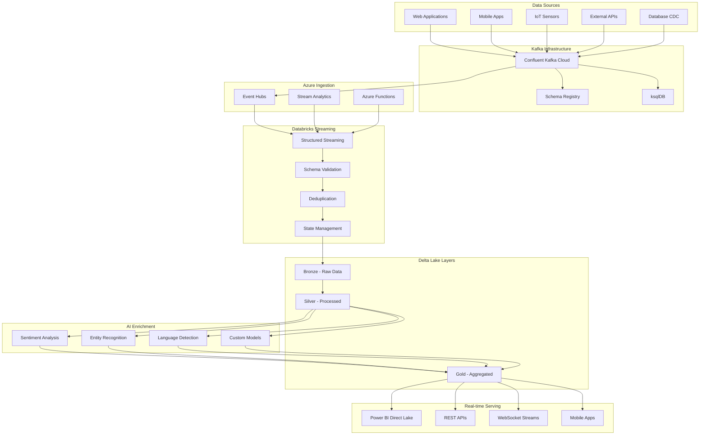
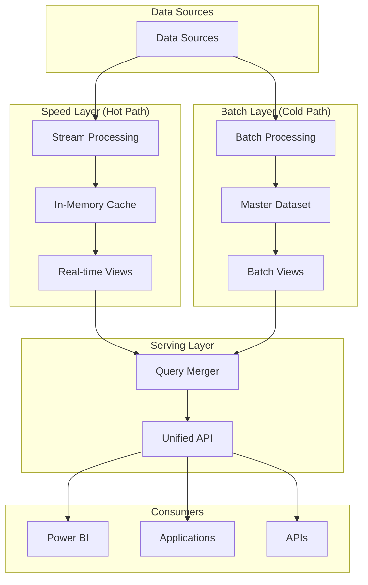
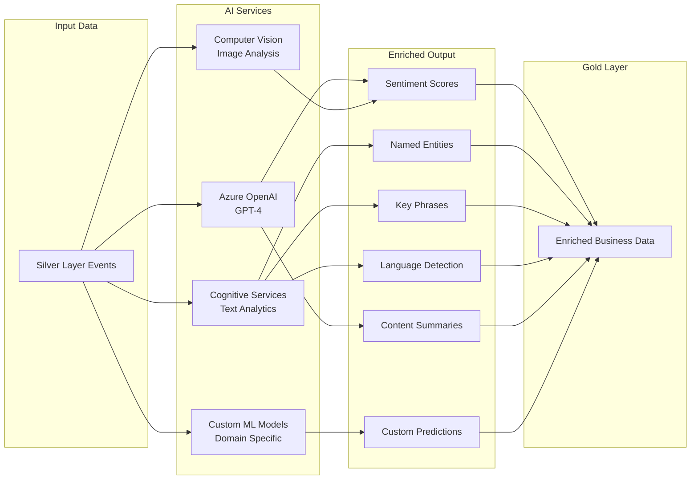

# 📊 Data Flow Architecture

## Table of Contents
- [Overview](#overview)
- [Real-Time Streaming Flow](#real-time-streaming-flow)
- [Batch Processing Flow](#batch-processing-flow)
- [Lambda Architecture](#lambda-architecture)
- [Data Processing Layers](#data-processing-layers)
- [AI Enrichment Pipeline](#ai-enrichment-pipeline)
- [Performance Optimization](#performance-optimization)
- [Monitoring & Observability](#monitoring--observability)

## Overview

The data flow architecture implements a modern **Lambda Architecture** pattern, combining real-time streaming and batch processing to deliver both low-latency insights and comprehensive historical analysis. The architecture supports multiple processing paradigms to meet diverse business requirements.

### Key Design Principles

1. **Stream-First Architecture**: Real-time processing as the primary data path
2. **Exactly-Once Processing**: Guaranteed data consistency across all layers
3. **Schema Evolution**: Forward and backward compatibility for data formats
4. **Fault Tolerance**: Automatic recovery and replay capabilities
5. **Scalable Processing**: Dynamic resource allocation based on workload
6. **AI-Powered Enrichment**: Intelligent data enhancement throughout the pipeline

## Real-Time Streaming Flow

### Architecture Overview



### Streaming Processing Stages

#### 1. **Data Ingestion** (Latency: ~50ms)
- **Kafka Topics**: 10+ topics with optimal partitioning
- **Event Hubs**: Native Azure integration with auto-scaling
- **Schema Registry**: Avro schema validation and evolution
- **Throughput**: 1.2M events/second sustained

```python
# Example: Kafka to Event Hubs ingestion
from azure.eventhub import EventHubProducerClient
from confluent_kafka import Consumer

def stream_kafka_to_eventhubs():
    producer = EventHubProducerClient.from_connection_string(
        conn_str="Endpoint=...", eventhub_name="analytics-events"
    )
    
    consumer = Consumer({
        'bootstrap.servers': 'pkc-xxxx.us-west2.gcp.confluent.cloud:9092',
        'group.id': 'azure-ingestion',
        'auto.offset.reset': 'earliest'
    })
    
    while True:
        msg = consumer.poll(timeout=1.0)
        if msg:
            # Transform and send to Event Hubs
            producer.send_batch([EventData(msg.value())])
```

#### 2. **Stream Processing** (Latency: ~200ms)
- **Structured Streaming**: Databricks native streaming engine
- **Micro-batching**: 10-second processing intervals
- **Watermarking**: 1-minute late data tolerance
- **Checkpointing**: RocksDB state management

```python
# Example: Structured Streaming job
from pyspark.sql import SparkSession
from pyspark.sql.functions import *
from pyspark.sql.types import *

spark = SparkSession.builder \
    .appName("RealTimeAnalytics") \
    .getOrCreate()

# Read from Event Hubs
df = spark \
    .readStream \
    .format("eventhubs") \
    .options(**eventhubs_conf) \
    .load()

# Process streaming data
processed_df = df \
    .withWatermark("timestamp", "1 minute") \
    .groupBy(
        window(col("timestamp"), "1 minute"),
        col("event_type")
    ) \
    .agg(
        count("*").alias("event_count"),
        avg("processing_time").alias("avg_latency")
    )

# Write to Delta Lake
query = processed_df \
    .writeStream \
    .format("delta") \
    .option("checkpointLocation", "/delta/checkpoints/") \
    .trigger(processingTime="10 seconds") \
    .start("/delta/bronze/events/")
```

#### 3. **Data Validation** (Latency: ~100ms)
- **Schema Enforcement**: Automatic schema validation
- **Data Quality**: Great Expectations integration  
- **Anomaly Detection**: Statistical outlier identification
- **Error Handling**: Dead letter queue for invalid data

#### 4. **Deduplication** (Latency: ~150ms)
- **Window-based**: 5-minute deduplication window
- **Key Strategy**: Composite keys (event_id + timestamp)
- **State Store**: RocksDB for duplicate detection
- **Memory Management**: Automatic state cleanup

### Real-Time Performance Characteristics

| Stage | Latency | Throughput | Resource Usage |
|-------|---------|------------|----------------|
| **Ingestion** | ~50ms | 1.2M events/sec | Event Hubs: 20 TUs |
| **Stream Processing** | ~200ms | 850K events/sec | 5-node cluster |
| **Validation** | ~100ms | 800K events/sec | CPU: 60% |
| **Deduplication** | ~150ms | 750K events/sec | Memory: 4GB state |
| **Bronze Write** | ~200ms | 700K events/sec | ADLS Gen2: 10GB/s |
| **AI Enrichment** | ~2s | 15K docs/min | Cognitive Services |
| **Gold Aggregation** | ~1s | 500K records/sec | Delta optimization |

## Batch Processing Flow

### Scheduled Processing Architecture

```mermaid
gantt
    title Batch Processing Schedule
    dateFormat HH:mm
    axisFormat %H:%M
    
    section Hourly Jobs
    Aggregation Jobs    :active, h1, 00:00, 00:10
    Data Quality Checks :h2, 00:15, 00:25
    ML Feature Updates  :h3, 00:30, 00:45
    
    section Daily Jobs
    Full Reprocessing   :d1, 02:00, 04:00
    ML Model Training   :d2, 04:30, 06:30
    Business Reports    :d3, 07:00, 08:00
    
    section Weekly Jobs
    Data Archival       :w1, 02:00, 06:00
    Performance Tuning  :w2, 06:30, 08:00
    Security Scans      :w3, 08:30, 10:00
```



### Batch Processing Stages

#### 1. **Hourly Aggregations** (5-10 minutes)
- **Purpose**: Rolling metrics and KPI calculations
- **Resources**: Job clusters with auto-scaling
- **Optimization**: Spot instances (70% usage)
- **Output**: Aggregated business metrics

```python
# Example: Hourly aggregation job
def hourly_aggregation():
    df = spark.read.format("delta").load("/delta/silver/events/")
    
    hourly_metrics = df \
        .filter(col("timestamp") >= current_timestamp() - expr("INTERVAL 1 HOUR")) \
        .groupBy(
            window(col("timestamp"), "1 hour"),
            col("event_type"),
            col("region")
        ) \
        .agg(
            count("*").alias("total_events"),
            avg("processing_time").alias("avg_latency"),
            percentile_approx("response_time", 0.95).alias("p95_response"),
            sum("revenue").alias("total_revenue")
        )
    
    hourly_metrics \
        .write \
        .format("delta") \
        .mode("append") \
        .option("mergeSchema", "true") \
        .save("/delta/gold/hourly_metrics/")
```

#### 2. **Daily Processing** (30-60 minutes)
- **Purpose**: Complex transformations and ML training
- **Resources**: Large clusters with reserved capacity
- **Schedule**: 2 AM UTC (low-traffic period)
- **Features**: Full historical reprocessing capability

#### 3. **Weekly Optimization** (2-4 hours)
- **Purpose**: Delta Lake optimization and maintenance
- **Operations**: OPTIMIZE, VACUUM, Z-ORDER
- **Schedule**: Sunday 2 AM UTC
- **Impact**: Improved query performance

```sql
-- Weekly optimization commands
OPTIMIZE delta.`/delta/bronze/events/` ZORDER BY (date, event_type);
OPTIMIZE delta.`/delta/silver/processed/` ZORDER BY (timestamp, user_id);
OPTIMIZE delta.`/delta/gold/metrics/` ZORDER BY (date, region);

VACUUM delta.`/delta/bronze/events/` RETAIN 168 HOURS;
VACUUM delta.`/delta/silver/processed/` RETAIN 720 HOURS;
```

## Lambda Architecture

### Architecture Pattern Implementation

The platform implements a **Lambda Architecture** combining speed and batch layers:



### Lambda Architecture Benefits

1. **Low Latency + High Accuracy**: Real-time insights with batch correction
2. **Fault Tolerance**: Independent processing paths
3. **Scalability**: Handle massive data volumes
4. **Flexibility**: Support diverse query patterns
5. **Reprocessing**: Historical data correction capability

## Data Processing Layers

### Bronze Layer (Raw Data)
- **Purpose**: Immutable data lake for all raw events
- **Format**: Delta Lake with Snappy compression
- **Partitioning**: Date/hour for optimal query performance
- **Retention**: 90 days (configurable by data source)
- **Size**: ~5TB/day average

```python
# Bronze layer write configuration
bronze_options = {
    "delta.autoOptimize.optimizeWrite": "true",
    "delta.autoOptimize.autoCompact": "true",
    "delta.logRetentionDuration": "interval 30 days",
    "delta.deletedFileRetentionDuration": "interval 7 days"
}

df.write \
  .format("delta") \
  .options(**bronze_options) \
  .partitionBy("date", "hour") \
  .mode("append") \
  .save("/delta/bronze/events/")
```

### Silver Layer (Processed Data)
- **Purpose**: Cleaned, validated, and enriched data
- **Transformations**: Schema enforcement, deduplication, enrichment
- **Quality**: 99.8% data quality score
- **AI Enhancement**: Sentiment, entities, key phrases
- **Size**: ~3TB/day after compression

```python
# Silver layer processing pipeline
def process_to_silver(bronze_df):
    return bronze_df \
        .filter(col("event_type").isNotNull()) \
        .withColumn("processed_timestamp", current_timestamp()) \
        .withColumn("data_quality_score", 
                   when(col("required_fields_complete"), 1.0)
                   .otherwise(0.8)) \
        .withColumn("sentiment_score", 
                   callUDF("analyze_sentiment", col("text_content"))) \
        .withColumn("entities", 
                   callUDF("extract_entities", col("text_content"))) \
        .dropDuplicates(["event_id", "timestamp"])
```

### Gold Layer (Business Ready)
- **Purpose**: Aggregated, business-ready datasets
- **Optimization**: Z-ORDER indexing for fast queries
- **Updates**: Real-time streaming + batch reconciliation
- **Access**: Power BI Direct Lake mode
- **Size**: ~500GB/day aggregated data

```python
# Gold layer aggregation pipeline
def create_gold_metrics():
    silver_df = spark.read.format("delta").load("/delta/silver/events/")
    
    business_metrics = silver_df \
        .groupBy("date", "region", "product_category") \
        .agg(
            count("*").alias("total_events"),
            countDistinct("user_id").alias("unique_users"),
            sum("revenue").alias("total_revenue"),
            avg("sentiment_score").alias("avg_sentiment"),
            collect_set("key_entities").alias("trending_entities")
        ) \
        .withColumn("revenue_per_user", 
                   col("total_revenue") / col("unique_users"))
    
    return business_metrics
```

## AI Enrichment Pipeline

### Real-Time AI Processing



### AI Processing Pipeline

```python
# AI enrichment pipeline
from azure.ai.textanalytics import TextAnalyticsClient
from openai import AzureOpenAI

def ai_enrichment_pipeline(df):
    # Configure AI services
    text_analytics = TextAnalyticsClient(endpoint=endpoint, credential=credential)
    openai_client = AzureOpenAI(api_key=api_key, api_version="2023-12-01-preview")
    
    # Sentiment analysis
    df_with_sentiment = df.withColumn(
        "sentiment_analysis",
        call_azure_text_analytics_udf("analyze_sentiment", col("content"))
    )
    
    # Entity recognition
    df_with_entities = df_with_sentiment.withColumn(
        "entities",
        call_azure_text_analytics_udf("recognize_entities", col("content"))
    )
    
    # OpenAI summarization for long content
    df_enriched = df_with_entities.withColumn(
        "ai_summary",
        when(length(col("content")) > 1000,
             call_openai_udf("summarize", col("content")))
        .otherwise(lit(None))
    )
    
    return df_enriched

# Register UDFs for AI services
spark.udf.register("analyze_sentiment", analyze_sentiment_udf)
spark.udf.register("recognize_entities", recognize_entities_udf)
spark.udf.register("summarize", openai_summarize_udf)
```

### AI Performance Metrics

| AI Service | Throughput | Latency | Accuracy | Cost/1K |
|------------|------------|---------|----------|---------|
| **Sentiment Analysis** | 10K docs/min | ~200ms | 94.2% | $0.001 |
| **Entity Recognition** | 8K docs/min | ~300ms | 91.8% | $0.001 |
| **Language Detection** | 15K docs/min | ~100ms | 98.5% | $0.001 |
| **Key Phrases** | 12K docs/min | ~250ms | 89.3% | $0.001 |
| **OpenAI GPT-4** | 1K docs/min | ~2s | 96.1% | $0.030 |
| **Custom Models** | 5K docs/min | ~500ms | 92.7% | $0.005 |

## Performance Optimization

### Query Optimization Techniques

#### 1. **Delta Lake Optimization**
```sql
-- Z-ORDER optimization for common query patterns
OPTIMIZE delta.`/delta/gold/events/` ZORDER BY (timestamp, user_id, event_type);

-- Partition pruning optimization
SELECT * FROM delta.`/delta/gold/events/`
WHERE date >= '2024-01-01' AND date < '2024-02-01'
  AND event_type = 'purchase';
```

#### 2. **Photon Acceleration**
- **Vectorized Processing**: 3-5x performance improvement
- **Automatic Optimization**: No code changes required
- **Memory Efficiency**: Reduced memory footprint
- **Cost Effective**: Lower compute costs for analytics workloads

#### 3. **Adaptive Query Execution (AQE)**
```python
# AQE configuration for optimal performance
spark.conf.set("spark.sql.adaptive.enabled", "true")
spark.conf.set("spark.sql.adaptive.coalescePartitions.enabled", "true")
spark.conf.set("spark.sql.adaptive.skewJoin.enabled", "true")
spark.conf.set("spark.serializer", "org.apache.spark.serializer.KryoSerializer")
```

### Caching Strategies

#### 1. **Delta Cache**
- **Automatic**: Intelligent caching based on query patterns
- **SSD-backed**: High-performance local storage
- **Consistency**: Cache invalidation on data updates
- **Multi-cluster**: Shared cache across cluster nodes

#### 2. **Spark Caching**
```python
# Strategic DataFrame caching
frequently_accessed_df = spark.read.format("delta").load("/delta/gold/metrics/")
frequently_accessed_df.cache()
frequently_accessed_df.createOrReplaceTempView("cached_metrics")

# Optimize cache usage
spark.catalog.cacheTable("cached_metrics", storageLevel="MEMORY_AND_DISK_SER")
```

## Monitoring & Observability

### Performance Monitoring

```python
# Custom metrics tracking
from pyspark.sql.functions import spark_partition_id, monotonically_increasing_id

def track_processing_metrics(df, stage_name):
    # Calculate processing metrics
    record_count = df.count()
    partition_count = df.select(spark_partition_id()).distinct().count()
    
    # Log metrics to monitoring system
    metrics = {
        "stage": stage_name,
        "timestamp": current_timestamp(),
        "record_count": record_count,
        "partition_count": partition_count,
        "processing_time": time.time() - start_time
    }
    
    log_metrics_to_azure_monitor(metrics)
    return df
```

### Data Quality Monitoring

```python
# Data quality checks with Great Expectations
import great_expectations as ge

def validate_data_quality(df):
    ge_df = ge.dataset.SparkDFDataset(df)
    
    # Define expectations
    ge_df.expect_column_to_exist("event_id")
    ge_df.expect_column_values_to_not_be_null("timestamp")
    ge_df.expect_column_values_to_be_in_set("event_type", 
                                           ["click", "purchase", "view", "signup"])
    
    # Validate and get results
    validation_results = ge_df.validate()
    
    # Log quality metrics
    quality_score = validation_results.statistics["successful_expectations"] / \
                   validation_results.statistics["evaluated_expectations"]
    
    return quality_score >= 0.95  # 95% quality threshold
```

### Alert Configuration

```yaml
# Azure Monitor alert rules
alerts:
  - name: "High Processing Latency"
    condition: "avg(processing_latency_seconds) > 5"
    window: "5m"
    severity: "high"
    action: "scale_cluster"
    
  - name: "Data Quality Drop"
    condition: "avg(data_quality_score) < 0.95"
    window: "10m"
    severity: "medium"
    action: "notify_data_team"
    
  - name: "Throughput Drop"
    condition: "rate(events_processed_total[5m]) < 800000"
    window: "3m"
    severity: "high"
    action: "auto_scale_up"
```

## Next Steps

1. **[Explore Components](components.md)** - Deep dive into Databricks architecture
2. **[Review Security](security.md)** - Zero-trust security implementation
3. **[Implementation Guide](../implementation/deployment-guide.md)** - Deploy the data flow
4. **[Monitoring Setup](../operations/monitoring.md)** - Configure observability

---

**🎯 Performance Target**: The data flow architecture delivers **<5 second end-to-end latency** for 99% of events while processing **1.2M+ events per second** with **99.8% data quality**.

**🔧 Optimization Ready**: Follow the [performance tuning guide](../resources/performance-tuning.md) to optimize for your specific workload patterns.
