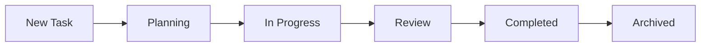

# 📊 Project Tracking Hub

> **🏠 [Home](../README.md)** | **📚 [Documentation](../docs/README.md)** | **🔧 [Scripts](../scripts/README.md)**

---

## 📋 Overview

This directory contains all project management, planning, and tracking documentation for the Cloud Scale Analytics (CSA) in-a-Box documentation project. It serves as the central hub for project coordination, task management, architectural decisions, and progress tracking.

## 🗂️ Directory Structure

```
project_tracking/
├── 📄 README.md                    # This file - Project tracking hub
├── 📄 AUDIT_REPORT_2025.md        # Comprehensive compliance audit
│
├── 📁 architecture/               # System architecture documentation
│   └── cloud-scale-analytics-structure.md
│
├── 📁 planning/                   # Project planning documents
│   ├── CHANGELOG.md              # Version history
│   ├── PLANNING.md               # Overall project plan
│   ├── ROADMAP.md                # Feature roadmap
│   ├── TASK.md                   # Current task list
│   └── various planning docs...
│
├── 📁 research/                   # Research and analysis
│   └── azure-streaming-architectures.md
│
├── 📁 roadmaps/                   # Feature and documentation roadmaps
│   └── documentation_roadmap.md
│
├── 📁 sprints/                    # Sprint planning and tracking
│   └── (Sprint documents)
│
├── 📁 status/                     # Project status reports
│   └── changelog_archive.md
│
├── 📁 tasks/                      # Task management
│   └── completed_tasks_phase1.md
│
└── 📁 tools/                      # Project automation tools
    ├── README.md                  # Tools documentation
    └── various Python scripts...
```

## 📊 Key Documents

### 🎯 Planning & Strategy

| Document | Purpose | Status |
|----------|---------|--------|
| [`PLANNING.md`](./planning/PLANNING.md) | Master project plan | ✅ Active |
| [`ROADMAP.md`](./planning/ROADMAP.md) | Feature development roadmap | ✅ Active |
| [`TASK.md`](./planning/TASK.md) | Current sprint tasks | 🔄 In Progress |
| [`CHANGELOG.md`](./planning/CHANGELOG.md) | Version history | 📝 Updated |

### 🏗️ Architecture

| Document | Purpose | Last Updated |
|----------|---------|--------------|
| [`cloud-scale-analytics-structure.md`](./architecture/cloud-scale-analytics-structure.md) | System architecture | 2025-01-28 |
| [`azure-streaming-architectures.md`](./research/azure-streaming-architectures.md) | Streaming patterns research | 2025-01-28 |

### 📈 Status & Reports

| Report | Purpose | Frequency |
|--------|---------|-----------|
| [`AUDIT_REPORT_2025.md`](./AUDIT_REPORT_2025.md) | Compliance audit | Quarterly |
| [`changelog_archive.md`](./status/changelog_archive.md) | Historical changes | As needed |
| [`completed_tasks_phase1.md`](./tasks/completed_tasks_phase1.md) | Completed work | Per phase |

## 🔄 Workflow

### Task Management Flow



### Document Update Cycle

1. **Planning Phase**
   - Update `PLANNING.md` with new initiatives
   - Add items to `ROADMAP.md`
   - Create tasks in `TASK.md`

2. **Execution Phase**
   - Track progress in sprint documents
   - Update task status regularly
   - Document decisions and changes

3. **Review Phase**
   - Update `CHANGELOG.md`
   - Archive completed tasks
   - Generate status reports

## 📋 Current Status

### Active Initiatives

| Initiative | Status | Priority | Target Date |
|------------|--------|----------|-------------|
| Documentation Restructuring | 🔄 In Progress | CRITICAL | 2025-02-01 |
| Compliance Remediation | 🔄 In Progress | CRITICAL | 2025-02-01 |
| Link Validation | ⏳ Pending | HIGH | 2025-02-05 |
| Style Guide Implementation | ⏳ Pending | MEDIUM | 2025-02-10 |

### Recent Updates

- **2025-01-28**: Comprehensive audit completed - critical violations found
- **2025-01-28**: Remediation plan created and initiated
- **2025-01-27**: Directory structure guide updated to v2.0.0

## 🛠️ Tools

The [`tools/`](./tools/) subdirectory contains automation scripts for:

- **Documentation Management**
  - `csa-docs-integration.py` - Documentation integration
  - `integrated_docs_workflow.py` - Workflow automation
  - `version-docs.py` - Version management

- **Quality Assurance**
  - `link_checker.py` - Link validation
  - `fix_markdown.py` - Markdown formatting fixes
  - `enhanced_link_checker.py` - Advanced link checking

- **Development Support**
  - `serve-docs.py` - Local documentation server
  - `update_tools_readme.py` - Tool documentation updates

See [`tools/README.md`](./tools/README.md) for detailed usage instructions.

## 📊 Metrics & KPIs

### Documentation Quality Metrics

| Metric | Current | Target | Status |
|--------|---------|--------|--------|
| Structure Compliance | 40% | 90% | ❌ Critical |
| Link Integrity | 30% | 95% | ❌ Critical |
| Documentation Coverage | 70% | 85% | ⚠️ Warning |
| Style Consistency | 65% | 80% | ⚠️ Warning |

### Project Health Indicators

- **Overall Health Score:** 52.5% 🔴
- **Critical Issues:** 12
- **Broken Links:** 62
- **Missing Documents:** 8

## 🎯 Quick Actions

### For Project Managers

- Review [`AUDIT_REPORT_2025.md`](./AUDIT_REPORT_2025.md) for compliance status
- Check [`TASK.md`](./planning/TASK.md) for current sprint items
- Monitor [`ROADMAP.md`](./planning/ROADMAP.md) for upcoming features

### For Developers

- Consult [`PLANNING.md`](./planning/PLANNING.md) for technical approach
- Use tools in [`tools/`](./tools/) for automation
- Follow guides in [`../docs/guides/`](../docs/guides/)

### For Contributors

- Read [`../docs/guides/CONTRIBUTING_GUIDE.md`](../docs/guides/CONTRIBUTING_GUIDE.md) (when created)
- Check [`TASK.md`](./planning/TASK.md) for open items
- Review [`CHANGELOG.md`](./planning/CHANGELOG.md) for recent changes

## 📝 Maintenance

### Regular Tasks

- **Daily**: Update task status
- **Weekly**: Review and update TASK.md
- **Sprint End**: Archive completed tasks, update CHANGELOG
- **Monthly**: Generate status report
- **Quarterly**: Perform compliance audit

### File Management

- Keep active documents in root of relevant subdirectory
- Archive completed items with date prefix (e.g., `2025-01-completed.md`)
- Maintain README.md files in all subdirectories
- Regular cleanup of outdated documents

## 🔗 Related Documentation

- [Documentation Hub](../docs/README.md)
- [Directory Structure Guide](../docs/guides/DIRECTORY_STRUCTURE_GUIDE.md)
- [Markdown Style Guide](../docs/guides/MARKDOWN_STYLE_GUIDE.md)
- [Project README](../README.md)

## 📞 Contact

For questions or issues related to project tracking:

- **Project Lead**: CSA Documentation Team
- **GitHub Issues**: [Create Issue](https://github.com/fgarofalo56/csa-inabox-docs/issues)
- **Internal Slack**: #csa-documentation

---

**Last Updated:** January 28, 2025  
**Version:** 1.0.0  
**Status:** ✅ Active