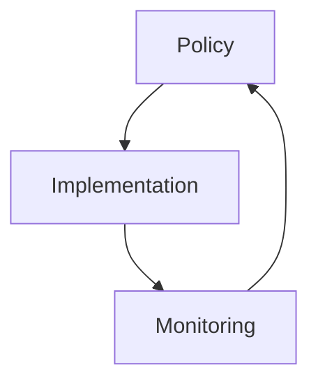

# CSA Documentation Tools

[](https://github.com/your-org/csa-inabox-docs)
[](https://github.com/your-org/csa-inabox-docs)
[](https://www.npmjs.com/package/csa-docs-tools)
[](LICENSE)

A unified, production-grade documentation tooling suite for Cloud Scale Analytics documentation management. This tool consolidates multiple JavaScript utilities into a single, well-structured Node.js package with clean architecture principles.

## 🚀 Features

- **📊 Documentation Auditing**: Comprehensive analysis of documentation quality and structure
- **🎨 Diagram Generation**: Convert Mermaid diagrams to PNG images with fallback support
- **🔧 Automated Fixes**: Fix common documentation issues automatically
- **🔗 Link Validation**: Validate internal and external links
- **🖼️ Image Optimization**: Optimize images for web delivery
- **📋 Reporting**: Generate detailed reports in text or JSON format
- **🏗️ Build Pipeline**: Complete documentation build and validation pipeline
- **🎯 CLI Interface**: Easy-to-use command-line interface with rich formatting

## 📦 Installation

### Prerequisites

- Node.js 18+ 
- npm 8+
- Mermaid CLI (for diagram generation)

### Install Dependencies

```bash
# Clone or navigate to the tools directory
cd tools

# Install dependencies
npm install

# Install Mermaid CLI globally (required for diagram generation)
npm install -g @mermaid-js/mermaid-cli

# Make CLI executable
chmod +x src/bin/csa-docs.js
```

### Global Installation (Optional)

```bash
# Link for global access
npm link

# Now you can use 'csa-docs' from anywhere
csa-docs --help
```

## 🎯 Quick Start

```bash
# Check tool status and configuration
csa-docs info

# Run documentation audit
csa-docs audit --output json --save-report audit-report.json

# Generate diagrams from Mermaid placeholders
csa-docs generate-diagrams --theme default --background transparent

# Replace Mermaid blocks with PNG references
csa-docs replace-mermaid

# Fix common documentation issues
csa-docs fix-issues --create-missing --fix-links

# Run complete build pipeline
csa-docs build

# Show documentation health status
csa-docs status --detailed
```

## 🏗️ Architecture

The tool follows clean architecture principles with clear separation of concerns:

```
src/
├── domain/           # Business entities and rules
│   └── models/       # Domain models
├── infrastructure/   # External concerns (file I/O, external tools)
├── services/         # Business logic orchestration  
├── presentation/     # CLI interface
├── bin/             # Entry points
└── types/           # TypeScript definitions
```

### Key Components

- **DocumentationFile**: Core domain model for documentation files
- **AuditReport**: Aggregates and analyzes documentation issues
- **DiagramMapping**: Business rules for diagram identification and mapping
- **FileSystemRepository**: File system operations abstraction
- **MermaidRenderer**: Mermaid CLI integration
- **DocumentationAuditService**: Orchestrates audit operations
- **DiagramGenerationService**: Handles diagram generation workflow
- **DocumentationFixService**: Automated issue resolution

## 🔧 Command Reference

### Global Options

- `--verbose, -v`: Enable verbose logging
- `--no-color`: Disable colored output  
- `--log-file <file>`: Log output to file
- `--docs-dir <dir>`: Documentation directory (default: `docs`)

### Commands

#### `audit`
Run comprehensive documentation audit

```bash
csa-docs audit [options]

Options:
  --fix-duplicates          Auto-fix duplicate index/README files (default: true)
  --output <format>         Output format: text|json (default: text)
  --save-report <file>      Save report to file
```

**Example:**
```bash
csa-docs audit --output json --save-report reports/audit-$(date +%Y%m%d).json
```

#### `generate-diagrams`
Generate PNG diagrams from Mermaid placeholders

```bash
csa-docs generate-diagrams [options]

Options:
  --input-dir <dir>         Input directory with placeholder files
  --output-dir <dir>        Output directory for PNG files  
  --theme <theme>           Mermaid theme: default|dark|forest|neutral (default: default)
  --background <color>      Background color (default: transparent)
  --width <pixels>          Diagram width (default: 1920)
  --height <pixels>         Diagram height (default: 1080)
```

#### `replace-mermaid`
Replace Mermaid blocks with PNG image references

```bash
csa-docs replace-mermaid [options]

Options:
  --dry-run                 Preview changes without modifying files
```

#### `fix-issues`
Automatically fix common documentation issues

```bash
csa-docs fix-issues [options]

Options:
  --create-missing          Create missing referenced files (default: true)
  --fix-links              Fix broken internal links (default: true)
  --remove-orphans         Remove orphaned diagram files (default: true)
  --update-nav             Update navigation structure (default: true)
  --preserve-diagram-files  Preserve .png.md diagram files
```

#### `validate-links`
Validate internal and external links

```bash
csa-docs validate-links [options]

Options:
  --external               Include external link validation
  --timeout <ms>           Timeout for external checks (default: 5000)
  --concurrent <num>       Concurrent link checks (default: 10)
```

#### `build`
Run complete documentation build pipeline

```bash
csa-docs build [options]

Options:
  --skip-audit             Skip documentation audit
  --skip-diagrams          Skip diagram generation  
  --skip-fixes             Skip automated fixes
  --skip-validation        Skip link validation
```

#### `status`
Show documentation status and health metrics

```bash
csa-docs status [options]

Options:
  --detailed               Show detailed status information
```

#### `info`
Show tool and environment information

```bash
csa-docs info
```

## 📊 Understanding Reports

### Health Score

The documentation health score (0-100) is calculated based on:

- **Critical Issues** (weight: 3): Empty files, broken functionality
- **Warning Issues** (weight: 1): Broken links, duplicates  
- **Info Issues** (weight: 0.2): Orphaned files, style issues

**Score Interpretation:**
- **90-100**: Excellent documentation health
- **70-89**: Good documentation health  
- **50-69**: Needs attention
- **Below 50**: Critical issues need immediate attention

### Issue Types

| Type | Severity | Description |
|------|----------|-------------|
| **Empty Files** | Critical | Files with no content |
| **Broken Links** | Warning | Internal links pointing to non-existent files |
| **Orphaned Files** | Info | Files not linked from anywhere |
| **Duplicate Index/README** | Warning | Both index.md and README.md in same directory |
| **Minimal Content** | Warning | Files with very little content |
| **Inaccessible Files** | Info | Files not reachable from root navigation |

## 🎨 Diagram Generation

### Supported Diagram Types

The tool includes hardcoded fallback diagrams for common Azure/Synapse patterns:

- `integrated-data-governance`
- `governance-maturity-model`
- `compliance-controls`
- `data-protection-model`
- `identity-access-architecture`
- `network-isolation-architecture`
- `sensitive-data-protection`

### Diagram Workflow

1. **Placeholder Files**: Create `.png.md` files with Mermaid content
2. **Generation**: Tool converts Mermaid to PNG using CLI
3. **Replacement**: Mermaid blocks in documentation replaced with PNG references
4. **Cleanup**: Optional removal of placeholder files

### Example Placeholder File

```markdown
# Governance Architecture Diagram


```

## 🔧 Configuration

### Environment Variables

```bash
# Mermaid CLI configuration
MERMAID_CLI_PATH=/usr/local/bin/mmdc
MERMAID_CONFIG_PATH=./mermaid.config.json

# Logging configuration  
LOG_LEVEL=info
LOG_FILE=./logs/csa-docs.log

# Tool behavior
CSA_DOCS_DIR=./docs
CSA_AUTO_FIX=true
```

### Custom Mermaid Configuration

Create `mermaid.config.json`:

```json
{
  "theme": "default",
  "themeVariables": {
    "primaryColor": "#ff6b6b",
    "primaryTextColor": "#2c3e50"
  },
  "flowchart": {
    "htmlLabels": false,
    "curve": "basis"
  }
}
```

## 🧪 Development

### Running Tests

```bash
# Run all tests
npm test

# Run with coverage
npm run test:coverage

# Watch mode
npm run test:watch

# Run specific test suite
npm test -- --testPathPattern=domain
```

### Code Quality

```bash
# Lint code
npm run lint

# Fix linting issues
npm run lint:fix

# Format code
npm run format

# Type checking (if using TypeScript)
npm run type-check
```

### Building

```bash
# Build the project
npm run build

# Check build quality
npm run validate
```

## 🚀 CI/CD Integration

### GitHub Actions

```yaml
name: Documentation Tools

on: [push, pull_request]

jobs:
  docs-validation:
    runs-on: ubuntu-latest
    steps:
      - uses: actions/checkout@v3
      - uses: actions/setup-node@v3
        with:
          node-version: '18'
      
      - name: Install dependencies
        run: |
          cd tools
          npm install
          npm install -g @mermaid-js/mermaid-cli
      
      - name: Run documentation audit
        run: |
          cd tools
          npm run docs:audit -- --output json --save-report audit-report.json
      
      - name: Generate diagrams
        run: |
          cd tools  
          npm run docs:generate
      
      - name: Validate links
        run: |
          cd tools
          npm run docs:validate
```

### Pre-commit Hooks

```json
{
  "husky": {
    "hooks": {
      "pre-commit": "cd tools && npm run docs:audit && npm run lint",
      "pre-push": "cd tools && npm run build && npm test"
    }
  }
}
```

## 📈 Monitoring and Metrics

### Key Metrics to Track

- Documentation health score over time
- Number of broken links
- Diagram generation success rate  
- Build pipeline success rate
- Time to fix documentation issues

### Recommended Thresholds

- **Health Score**: > 85
- **Broken Links**: 0
- **Empty Files**: 0
- **Build Time**: < 5 minutes

## 🤝 Integration with Existing Tools

### project_tracking/tools Integration

The unified tooling integrates with existing Python tools:

```bash
# Use new tools in existing workflows
python project_tracking/tools/serve-docs.py &
csa-docs build --skip-validation
```

### MkDocs Integration

```yaml
# mkdocs.yml
plugins:
  - csa-docs:
      audit: true
      generate_diagrams: true
      fix_issues: true
```

## 🐛 Troubleshooting

### Common Issues

#### Mermaid CLI Not Found

```bash
# Install globally
npm install -g @mermaid-js/mermaid-cli

# Check installation
npx mmdc --version

# Verify in tool
csa-docs info
```

#### Permission Errors

```bash
# Fix permissions
chmod +x src/bin/csa-docs.js

# Check file permissions
ls -la src/bin/
```

#### Large Repository Performance

```bash
# Use specific directory
csa-docs audit --docs-dir ./specific-docs

# Skip expensive operations
csa-docs build --skip-validation --skip-diagrams
```

#### Memory Issues

```bash
# Increase Node.js heap size
export NODE_OPTIONS="--max-old-space-size=8192"
csa-docs build
```

### Getting Help

1. **Check tool status**: `csa-docs info`
2. **Enable verbose logging**: `csa-docs <command> --verbose`
3. **Check logs**: Review log files if configured
4. **Run diagnostics**: `csa-docs status --detailed`

## 📚 Examples

### Basic Workflow

```bash
# 1. Initial audit
csa-docs audit --save-report initial-audit.json

# 2. Fix issues
csa-docs fix-issues

# 3. Generate diagrams  
csa-docs generate-diagrams --theme dark

# 4. Replace Mermaid blocks
csa-docs replace-mermaid

# 5. Final validation
csa-docs build
```

### Advanced Usage

```bash
# Custom build pipeline
csa-docs audit --output json | jq '.summary.healthScore' | \
while read score; do
  if [ "$score" -lt 80 ]; then
    csa-docs fix-issues
    csa-docs build --skip-validation
  fi
done
```

### Automated Reporting

```bash
#!/bin/bash
# weekly-docs-report.sh

DATE=$(date +%Y-%m-%d)
REPORT_DIR="reports/$DATE"

mkdir -p "$REPORT_DIR"

csa-docs audit --output json --save-report "$REPORT_DIR/audit.json"
csa-docs status --detailed > "$REPORT_DIR/status.txt"

# Send to monitoring system
curl -X POST "$MONITORING_WEBHOOK" \
  -d @"$REPORT_DIR/audit.json" \
  -H "Content-Type: application/json"
```

## 🔄 Migration from Legacy Tools

### From Individual Scripts

The unified tool replaces these legacy scripts:

- `comprehensive-audit.js` → `csa-docs audit`
- `generate-diagrams.js` → `csa-docs generate-diagrams`
- `replace-mermaid.js` → `csa-docs replace-mermaid`
- `fix-documentation-issues.js` → `csa-docs fix-issues`

### Migration Steps

1. **Install new tooling**: Follow installation instructions
2. **Test in parallel**: Run both old and new tools to compare
3. **Update CI/CD**: Replace script calls with CLI commands
4. **Update documentation**: Update team processes
5. **Remove legacy**: Archive old scripts after validation

## 📄 License

MIT License - see [LICENSE](../LICENSE) for details.

## 🤝 Contributing

1. Fork the repository
2. Create your feature branch: `git checkout -b feature/amazing-feature`
3. Commit your changes: `git commit -m 'Add amazing feature'`
4. Push to the branch: `git push origin feature/amazing-feature`
5. Open a Pull Request

### Development Standards

- Follow clean architecture principles
- Maintain > 80% test coverage
- Use TypeScript definitions
- Update documentation
- Follow conventional commits

## 📞 Support

- **Documentation Issues**: Create GitHub issue
- **Feature Requests**: GitHub discussions
- **Security Issues**: Email security@yourorg.com

## 🗺️ Roadmap

- [ ] External link validation with retry logic
- [ ] Image optimization with Sharp integration
- [ ] Plugin system for custom rules
- [ ] Web dashboard for metrics
- [ ] Integration with popular documentation frameworks
- [ ] Advanced diagram templates
- [ ] Multi-language documentation support

---

**Built with ❤️ for the Cloud Scale Analytics documentation team**