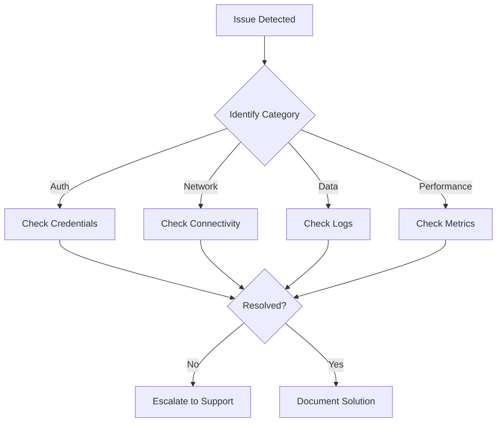

# Troubleshooting Guide

> **[Home](../README.md)** | **Troubleshooting**

Comprehensive troubleshooting resources for Cloud Scale Analytics.

---

## Quick Navigation

This is a legacy path. For the most up-to-date troubleshooting documentation, please visit:

**[Full Troubleshooting Documentation](../docs/troubleshooting/README.md)**

---

## Common Issues by Category

### Authentication & Access

| Issue | Quick Solution | Full Guide |
|-------|----------------|------------|
| Azure AD token errors | Check token expiration and refresh | [Authentication Troubleshooting](../docs/troubleshooting/authentication-troubleshooting.md) |
| Service principal issues | Verify credentials and permissions | [Authentication Troubleshooting](../docs/troubleshooting/authentication-troubleshooting.md) |
| RBAC permission denied | Review role assignments | [Security Troubleshooting](../docs/troubleshooting/security-troubleshooting.md) |

### Connectivity

| Issue | Quick Solution | Full Guide |
|-------|----------------|------------|
| Private endpoint failures | Check DNS resolution | [Connectivity Troubleshooting](../docs/troubleshooting/connectivity-troubleshooting.md) |
| Firewall blocking | Review IP allowlist | [Connectivity Troubleshooting](../docs/troubleshooting/connectivity-troubleshooting.md) |
| VNet integration issues | Verify subnet delegation | [Connectivity Troubleshooting](../docs/troubleshooting/connectivity-troubleshooting.md) |

### Data Processing

| Issue | Quick Solution | Full Guide |
|-------|----------------|------------|
| Spark job failures | Check executor logs | [Spark Troubleshooting](../docs/troubleshooting/spark-troubleshooting.md) |
| Delta Lake errors | Verify table schema | [Delta Lake Troubleshooting](../docs/troubleshooting/delta-lake-troubleshooting.md) |
| Pipeline failures | Review activity logs | [Pipeline Troubleshooting](../docs/troubleshooting/pipeline-troubleshooting.md) |
| SQL query timeouts | Optimize query patterns | [Serverless SQL Troubleshooting](../docs/troubleshooting/serverless-sql-troubleshooting.md) |

### Performance

| Issue | Quick Solution | Full Guide |
|-------|----------------|------------|
| Slow queries | Review execution plan | [Performance Issues](../docs/troubleshooting/performance-issues.md) |
| Resource exhaustion | Scale compute resources | [Performance Issues](../docs/troubleshooting/performance-issues.md) |
| Memory errors | Optimize data partitioning | [Spark Troubleshooting](../docs/troubleshooting/spark-troubleshooting.md) |

---

## Troubleshooting Workflow

---

## Support Resources

- **Azure Support**: [Azure Portal Support](https://portal.azure.com/#blade/Microsoft_Azure_Support/HelpAndSupportBlade)
- **Documentation**: [Full Troubleshooting Guide](../docs/troubleshooting/README.md)
- **Community**: [Microsoft Q&A](https://docs.microsoft.com/answers)

---

*Last Updated: January 2025*
