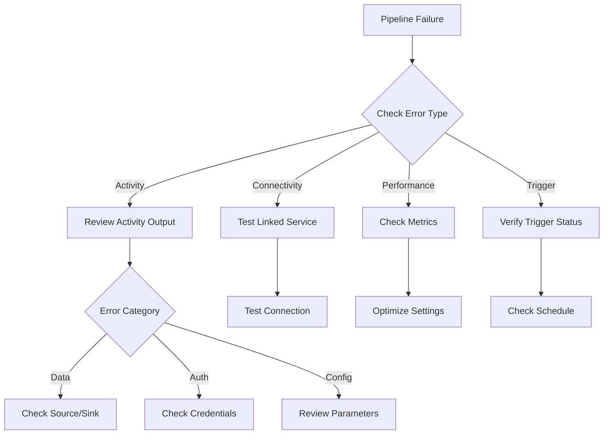

# Pipeline Troubleshooting

> **[Home](../../README.md)** | **[Troubleshooting](../index.md)** | **Pipeline Troubleshooting**


Comprehensive troubleshooting guide for data pipelines.

---

## Overview

This guide covers troubleshooting for:

- Azure Data Factory pipelines
- Synapse Pipelines
- Databricks workflows
- Custom orchestration pipelines

For detailed troubleshooting, see: **[Full Pipeline Troubleshooting Guide](../../docs/troubleshooting/pipeline-troubleshooting.md)**

---

## Common Pipeline Issues

### 1. Activity Failures

#### Copy Activity Failures

```json
{
    "errorCode": "UserErrorInvalidBlobPathCharacters",
    "message": "The path contains invalid characters"
}
```

**Solution:**
```json
{
    "source": {
        "type": "BlobSource",
        "recursive": true
    },
    "sink": {
        "type": "ParquetSink",
        "storeSettings": {
            "type": "AzureBlobStorageWriteSettings"
        }
    },
    "enableSkipIncompatibleRow": true,
    "logSettings": {
        "enableCopyActivityLog": true,
        "copyActivityLogSettings": {
            "logLevel": "Warning",
            "enableReliableLogging": true
        }
    }
}
```

#### Data Flow Failures

```json
{
    "errorCode": "DF-SYS-01",
    "message": "Spark job failed due to data skew"
}
```

**Solution:**
- Enable data flow debugging
- Add salt columns for skewed joins
- Increase partition count

---

### 2. Connectivity Issues

#### Self-Hosted Integration Runtime

**Check IR Status:**
```powershell
# Get IR status
Get-AzDataFactoryV2IntegrationRuntime `
    -ResourceGroupName "rg-data" `
    -DataFactoryName "adf-prod" `
    -Name "ir-selfhosted"
```

**Common Fixes:**
1. Verify network connectivity from IR machine
2. Check Windows Firewall rules
3. Update IR to latest version
4. Ensure service account has proper permissions

#### Private Endpoint Issues

```bash
# Check private endpoint connection
az network private-endpoint show \
    --name pe-storage \
    --resource-group rg-networking

# Verify DNS resolution
nslookup storage.blob.core.windows.net
```

---

### 3. Performance Issues

#### Slow Copy Activities

**Diagnostic Query (Synapse/ADF):**
```json
{
    "parallelCopies": 32,
    "dataIntegrationUnits": 256,
    "enableStaging": true,
    "stagingSettings": {
        "linkedServiceName": {
            "referenceName": "AzureBlobStorage",
            "type": "LinkedServiceReference"
        },
        "path": "staging"
    }
}
```

#### Memory Issues in Data Flows

**Optimize Settings:**
```json
{
    "compute": {
        "computeType": "MemoryOptimized",
        "coreCount": 16
    },
    "settings": {
        "timeToLive": 10,
        "quickReuse": true
    }
}
```

---

### 4. Trigger Issues

#### Schedule Trigger Not Firing

**Check Trigger Status:**
```bash
az datafactory trigger show \
    --factory-name adf-prod \
    --resource-group rg-data \
    --name daily-trigger
```

**Common Causes:**
- Trigger not started
- Time zone misconfiguration
- Dependency issues
- Concurrent run policy blocking

#### Tumbling Window Backfill

```json
{
    "type": "TumblingWindowTrigger",
    "typeProperties": {
        "frequency": "Hour",
        "interval": 1,
        "startTime": "2025-01-01T00:00:00Z",
        "delay": "00:15:00",
        "maxConcurrency": 5,
        "retryPolicy": {
            "count": 3,
            "intervalInSeconds": 30
        }
    }
}
```

---

## Debugging Workflow



---

## Monitoring Best Practices

### Enable Diagnostic Logging

```bash
az monitor diagnostic-settings create \
    --name pipeline-logs \
    --resource /subscriptions/.../datafactories/adf-prod \
    --workspace /subscriptions/.../workspaces/law-analytics \
    --logs '[{"category": "PipelineRuns", "enabled": true}, {"category": "ActivityRuns", "enabled": true}, {"category": "TriggerRuns", "enabled": true}]'
```

### KQL Queries for Analysis

```kusto
// Failed pipeline runs in last 24h
ADFPipelineRun
| where TimeGenerated > ago(24h)
| where Status == "Failed"
| summarize FailureCount = count() by PipelineName, bin(TimeGenerated, 1h)
| order by FailureCount desc

// Activity duration analysis
ADFActivityRun
| where TimeGenerated > ago(7d)
| where Status == "Succeeded"
| summarize
    AvgDuration = avg(Duration),
    MaxDuration = max(Duration),
    RunCount = count()
    by ActivityName, PipelineName
| order by AvgDuration desc
```

---

## Related Documentation

- [Data Factory Pipelines](../../docs/02-services/orchestration-services/azure-data-factory/README.md)
- [Pipeline Best Practices](../../docs/05-best-practices/pipeline-optimization/README.md)
- [Monitoring Setup](../../docs/09-monitoring/README.md)

---

*Last Updated: January 2025*
