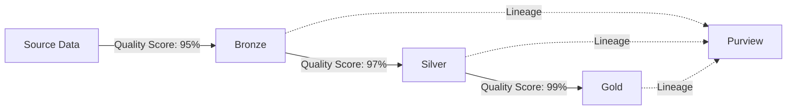

# Lineage-Driven Data Quality Tutorial

> **[Home](../../README.md)** | **[Tutorials](../README.md)** | **Lineage-Driven Quality**


Learn to implement data quality monitoring using lineage information.

---

## Overview

This tutorial covers:

- Connecting data quality to lineage
- Propagating quality metrics through pipelines
- Impact analysis for quality issues
- Automated quality alerts

**Duration**: 2 hours | **Prerequisites**: Azure Purview, data pipelines

---

## Concept: Lineage-Driven Quality



Quality metrics flow with data lineage, enabling:
- Root cause analysis for quality issues
- Impact assessment of source problems
- Quality SLA tracking across the pipeline

---

## Step 1: Define Quality Dimensions

### Quality Metrics Schema

```python
from dataclasses import dataclass
from datetime import datetime
from typing import Dict, List

@dataclass
class QualityMetrics:
    """Data quality metrics for a dataset."""

    asset_qualified_name: str
    timestamp: datetime
    row_count: int
    completeness: Dict[str, float]  # Column -> % non-null
    uniqueness: Dict[str, float]    # Column -> % unique
    validity: Dict[str, float]      # Column -> % passing rules
    freshness_hours: float
    overall_score: float

    def to_dict(self):
        return {
            "asset": self.asset_qualified_name,
            "timestamp": self.timestamp.isoformat(),
            "row_count": self.row_count,
            "completeness": self.completeness,
            "uniqueness": self.uniqueness,
            "validity": self.validity,
            "freshness_hours": self.freshness_hours,
            "overall_score": self.overall_score
        }
```

---

## Step 2: Calculate Quality Metrics

### PySpark Quality Checks

```python
from pyspark.sql import functions as F
from pyspark.sql import DataFrame

def calculate_quality_metrics(
    df: DataFrame,
    asset_name: str,
    quality_rules: Dict
) -> QualityMetrics:
    """Calculate comprehensive quality metrics."""

    total_rows = df.count()

    # Completeness: % non-null per column
    completeness = {}
    for col in df.columns:
        non_null = df.filter(F.col(col).isNotNull()).count()
        completeness[col] = (non_null / total_rows) * 100

    # Uniqueness: % unique values
    uniqueness = {}
    for col in quality_rules.get("unique_columns", []):
        distinct = df.select(col).distinct().count()
        uniqueness[col] = (distinct / total_rows) * 100

    # Validity: % passing custom rules
    validity = {}
    for rule_name, rule_expr in quality_rules.get("validity_rules", {}).items():
        passing = df.filter(rule_expr).count()
        validity[rule_name] = (passing / total_rows) * 100

    # Calculate overall score (weighted average)
    overall = (
        sum(completeness.values()) / len(completeness) * 0.4 +
        sum(uniqueness.values()) / len(uniqueness) * 0.3 if uniqueness else 100 * 0.3 +
        sum(validity.values()) / len(validity) * 0.3 if validity else 100 * 0.3
    )

    return QualityMetrics(
        asset_qualified_name=asset_name,
        timestamp=datetime.utcnow(),
        row_count=total_rows,
        completeness=completeness,
        uniqueness=uniqueness,
        validity=validity,
        freshness_hours=0,  # Calculate based on max timestamp
        overall_score=overall
    )

# Usage
rules = {
    "unique_columns": ["customer_id"],
    "validity_rules": {
        "valid_email": "email RLIKE '^[a-zA-Z0-9_.+-]+@[a-zA-Z0-9-]+\\.[a-zA-Z0-9-.]+$'",
        "positive_amount": "amount > 0"
    }
}

metrics = calculate_quality_metrics(df, "gold/customers", rules)
```

---

## Step 3: Store Quality Metrics with Lineage

### Attach Quality to Purview Assets

```python
from azure.purview.catalog import PurviewCatalogClient

def attach_quality_metrics(
    client: PurviewCatalogClient,
    asset_qualified_name: str,
    metrics: QualityMetrics
):
    """Attach quality metrics to Purview asset."""

    # Get existing asset
    asset = client.entity.get_by_unique_attribute(
        typeName="azure_datalake_gen2_path",
        qualifiedName=asset_qualified_name
    )

    # Update with quality attributes
    asset["entity"]["attributes"]["dataQualityScore"] = metrics.overall_score
    asset["entity"]["attributes"]["dataQualityTimestamp"] = metrics.timestamp.isoformat()
    asset["entity"]["attributes"]["dataQualityDetails"] = json.dumps(metrics.to_dict())

    # Update entity
    client.entity.create_or_update(asset)

    return asset["entity"]["guid"]
```

### Store in Delta Table

```python
# Create quality metrics Delta table
spark.sql("""
    CREATE TABLE IF NOT EXISTS governance.data_quality_metrics (
        asset_qualified_name STRING,
        timestamp TIMESTAMP,
        row_count BIGINT,
        completeness_score DOUBLE,
        uniqueness_score DOUBLE,
        validity_score DOUBLE,
        overall_score DOUBLE,
        details STRING
    )
    USING DELTA
    PARTITIONED BY (date(timestamp))
""")

# Insert metrics
metrics_df = spark.createDataFrame([metrics.to_dict()])
metrics_df.write.format("delta").mode("append").saveAsTable("governance.data_quality_metrics")
```

---

## Step 4: Propagate Quality Through Lineage

### Calculate Upstream Quality Impact

```python
def calculate_upstream_quality(
    client: PurviewCatalogClient,
    asset_qualified_name: str
) -> Dict:
    """Calculate quality considering upstream dependencies."""

    # Get upstream lineage
    lineage = client.lineage.get_lineage_by_unique_attribute(
        typeName="azure_datalake_gen2_path",
        qualifiedName=asset_qualified_name,
        direction="INPUT",
        depth=3
    )

    upstream_scores = []
    for guid, entity in lineage.get("guidEntityMap", {}).items():
        score = entity["attributes"].get("dataQualityScore")
        if score:
            upstream_scores.append(score)

    # Calculate effective quality (min of upstream + current)
    current_score = get_current_quality_score(asset_qualified_name)
    min_upstream = min(upstream_scores) if upstream_scores else 100

    return {
        "current_score": current_score,
        "min_upstream_score": min_upstream,
        "effective_score": min(current_score, min_upstream),
        "upstream_count": len(upstream_scores)
    }
```

---

## Step 5: Quality Alerts Based on Lineage

### Alert on Upstream Quality Issues

```python
def check_lineage_quality_alerts(
    client: PurviewCatalogClient,
    critical_assets: List[str],
    threshold: float = 95.0
):
    """Check if upstream quality issues affect critical assets."""

    alerts = []

    for asset in critical_assets:
        quality = calculate_upstream_quality(client, asset)

        if quality["effective_score"] < threshold:
            # Find problematic upstream asset
            upstream_issues = find_low_quality_upstream(client, asset, threshold)

            alerts.append({
                "critical_asset": asset,
                "effective_score": quality["effective_score"],
                "upstream_issues": upstream_issues,
                "alert_type": "UPSTREAM_QUALITY_DEGRADATION"
            })

    return alerts

def find_low_quality_upstream(
    client: PurviewCatalogClient,
    asset: str,
    threshold: float
) -> List[Dict]:
    """Find upstream assets with quality below threshold."""

    lineage = client.lineage.get_lineage_by_unique_attribute(
        typeName="azure_datalake_gen2_path",
        qualifiedName=asset,
        direction="INPUT",
        depth=5
    )

    issues = []
    for guid, entity in lineage.get("guidEntityMap", {}).items():
        score = entity["attributes"].get("dataQualityScore", 100)
        if score < threshold:
            issues.append({
                "asset": entity["attributes"]["qualifiedName"],
                "score": score,
                "owner": entity["attributes"].get("owner")
            })

    return issues
```

---

## Step 6: Quality Dashboard

### KQL Queries for Quality Monitoring

```kusto
// Quality trend by asset
DataQualityMetrics
| where timestamp > ago(30d)
| summarize
    AvgScore = avg(overall_score),
    MinScore = min(overall_score),
    MaxScore = max(overall_score)
    by asset_qualified_name, bin(timestamp, 1d)
| render timechart

// Quality degradation alerts
DataQualityMetrics
| where timestamp > ago(24h)
| summarize
    CurrentScore = arg_max(timestamp, overall_score),
    PreviousScore = arg_min(timestamp, overall_score)
    by asset_qualified_name
| where CurrentScore - PreviousScore < -5
| project asset_qualified_name, ScoreDrop = PreviousScore - CurrentScore
```

---

## Related Documentation

- [Data Quality Best Practices](../../best-practices/data-quality.md)
- [Purview Lineage Setup](../purview/lineage-setup.md)
- [Data Governance](../../best-practices/data-governance/README.md)

---

*Last Updated: January 2025*
