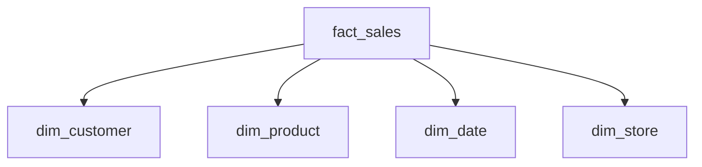

# Power BI Tutorials

> **[Home](../../README.md)** | **[Tutorials](../README.md)** | **Power BI**


Comprehensive Power BI tutorials for Cloud Scale Analytics.

---

## Overview

Learn how to build powerful reports and dashboards with Power BI connected to your analytics platform.

---

## Tutorial Index

### Getting Started

| Tutorial | Level | Duration |
|----------|-------|----------|
| [Connect to Serverless SQL](#connect-to-serverless-sql) | Beginner | 30 min |
| [DirectQuery vs Import](#directquery-vs-import) | Beginner | 45 min |
| [First Dashboard](#first-dashboard) | Beginner | 1 hour |

### Data Modeling

| Tutorial | Level | Duration |
|----------|-------|----------|
| [Star Schema Design](#star-schema) | Intermediate | 1.5 hours |
| [DAX Fundamentals](#dax-fundamentals) | Intermediate | 2 hours |
| [Aggregations](#aggregations) | Advanced | 1 hour |

### Advanced Topics

| Tutorial | Level | Duration |
|----------|-------|----------|
| [Row-Level Security](#row-level-security) | Intermediate | 1 hour |
| [Incremental Refresh](#incremental-refresh) | Advanced | 1 hour |
| [Real-Time Dashboards](#real-time-dashboards) | Advanced | 1.5 hours |

---

## Connect to Serverless SQL

### Step 1: Get Connection Details

```
Server: synapse-workspace-ondemand.sql.azuresynapse.net
Database: your_database
```

### Step 2: Connect from Power BI

1. Open Power BI Desktop
2. Get Data > Azure > Azure Synapse Analytics SQL
3. Enter server name
4. Select DirectQuery
5. Authenticate with Azure AD

### Step 3: Select Tables/Views

```sql
-- Create view for Power BI
CREATE VIEW reporting.vw_SalesDashboard AS
SELECT
    s.OrderDate,
    c.CustomerName,
    c.Region,
    p.ProductName,
    p.Category,
    s.Quantity,
    s.Amount
FROM gold.fact_sales s
JOIN gold.dim_customer c ON s.CustomerKey = c.CustomerKey
JOIN gold.dim_product p ON s.ProductKey = p.ProductKey;
```

---

## DirectQuery vs Import

| Aspect | DirectQuery | Import |
|--------|-------------|--------|
| Data freshness | Real-time | Scheduled refresh |
| Performance | Query-dependent | Fast (in-memory) |
| Data size | Unlimited | 1GB limit |
| DAX support | Limited | Full |
| Best for | Real-time needs | Standard reporting |

**Recommendation:** Use DirectQuery for real-time requirements, Import for best performance.

---

## Star Schema

### Design Pattern



### Implementation

```sql
-- Fact table
CREATE VIEW gold.fact_sales AS
SELECT
    DateKey,
    CustomerKey,
    ProductKey,
    StoreKey,
    Quantity,
    Amount,
    Cost
FROM delta.`/gold/sales/`;

-- Dimension table
CREATE VIEW gold.dim_customer AS
SELECT
    CustomerKey,
    CustomerName,
    Email,
    Region,
    Segment
FROM delta.`/gold/customers/`;
```

---

## DAX Fundamentals

### Common Measures

```dax
// Total Sales
Total Sales = SUM(fact_sales[Amount])

// Year-over-Year Growth
YoY Growth =
VAR CurrentYear = [Total Sales]
VAR PreviousYear = CALCULATE([Total Sales], SAMEPERIODLASTYEAR(dim_date[Date]))
RETURN DIVIDE(CurrentYear - PreviousYear, PreviousYear)

// Running Total
Running Total =
CALCULATE(
    [Total Sales],
    FILTER(
        ALL(dim_date[Date]),
        dim_date[Date] <= MAX(dim_date[Date])
    )
)
```

---

## Row-Level Security

### Implementation

```dax
// Create security role
// Filter: [Region] = USERPRINCIPALNAME()

// For testing: [Region] = "North" || USERPRINCIPALNAME() = "admin@company.com"
```

### Steps

1. Modeling > Manage Roles
2. Create new role
3. Add DAX filter expression
4. Test with "View as Role"
5. Publish and assign users

---

## Related Documentation

- [Power BI Optimization](../../best-practices/power-bi-optimization.md)
- [Power BI Troubleshooting](../../troubleshooting/power-bi-troubleshooting.md)
- [Data Analyst Path](../data-analyst-path.md)

---

*Last Updated: January 2025*
