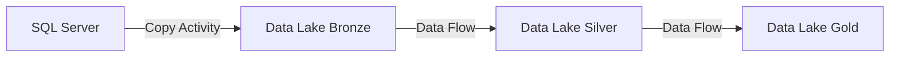

# Purview Lineage Setup Tutorial

> **[Home](../../README.md)** | **[Tutorials](../README.md)** | **Purview Lineage Setup**


Step-by-step guide to setting up data lineage tracking with Azure Purview.

---

## Overview

This tutorial covers:

- Connecting data sources to Purview
- Enabling automatic lineage capture
- Creating custom lineage relationships
- Querying and visualizing lineage

**Duration**: 2 hours | **Prerequisites**: Azure Purview account, data sources

---

## Step 1: Connect Synapse to Purview

### Azure Portal Configuration

```bash
# Link Synapse workspace to Purview
az synapse workspace update \
    --name synapse-workspace \
    --resource-group rg-analytics \
    --purview-configuration purviewAccountName=purview-account
```

### Verify Connection

1. Open Purview Studio
2. Navigate to Data Map > Sources
3. Verify Synapse workspace appears

---

## Step 2: Connect Data Factory

```bash
# Link Data Factory to Purview
az datafactory update \
    --factory-name adf-analytics \
    --resource-group rg-analytics \
    --purview-configuration purviewAccountName=purview-account
```

**Result:** All ADF pipeline runs will automatically capture lineage.

---

## Step 3: Scan Data Sources

### Register Data Lake

```bash
# Register ADLS Gen2
az purview scan register \
    --account-name purview-account \
    --name datalake-source \
    --resource-id /subscriptions/.../storageAccounts/datalake
```

### Configure Scan

```json
{
    "name": "weekly-scan",
    "kind": "AdlsGen2",
    "properties": {
        "scanRulesetName": "AdlsGen2",
        "collection": {
            "referenceName": "analytics-collection"
        },
        "credential": {
            "referenceName": "purview-msi"
        }
    },
    "schedule": {
        "frequency": "Weekly",
        "interval": 1,
        "startTime": "2025-01-01T06:00:00Z"
    }
}
```

---

## Step 4: View Automatic Lineage

### Data Factory Lineage

After running ADF pipelines, lineage is automatically captured:



### Synapse Lineage

Synapse pipeline activities and Spark jobs capture lineage automatically.

---

## Step 5: Create Custom Lineage

### Using Purview SDK

```python
from azure.purview.catalog import PurviewCatalogClient
from azure.identity import DefaultAzureCredential
import uuid

credential = DefaultAzureCredential()
client = PurviewCatalogClient(
    endpoint="https://purview-account.purview.azure.com",
    credential=credential
)

def create_custom_lineage(source_assets, target_asset, process_name):
    """Create custom lineage in Purview."""

    process_guid = str(uuid.uuid4())

    # Create process entity
    process_entity = {
        "typeName": "Process",
        "attributes": {
            "name": process_name,
            "qualifiedName": f"custom://process/{process_name}",
            "description": f"Custom transformation: {process_name}"
        },
        "guid": process_guid
    }

    # Build relationships
    input_relationships = [
        {
            "typeName": "process_dataset_inputs",
            "end1": {"guid": process_guid},
            "end2": {"guid": source["guid"]}
        }
        for source in source_assets
    ]

    output_relationship = {
        "typeName": "process_dataset_outputs",
        "end1": {"guid": process_guid},
        "end2": {"guid": target_asset["guid"]}
    }

    # Create entities
    result = client.entity.create_or_update({
        "entities": [process_entity],
        "relationships": input_relationships + [output_relationship]
    })

    return result

# Usage
create_custom_lineage(
    source_assets=[
        {"guid": "source-guid-1"},
        {"guid": "source-guid-2"}
    ],
    target_asset={"guid": "target-guid"},
    process_name="custom_aggregation_job"
)
```

---

## Step 6: Query Lineage

### Get Upstream Lineage

```python
def get_upstream(asset_qualified_name):
    """Get all upstream dependencies."""

    lineage = client.lineage.get_lineage_by_unique_attribute(
        typeName="azure_datalake_gen2_path",
        qualifiedName=asset_qualified_name,
        direction="INPUT",
        depth=5
    )

    upstream_assets = []
    for guid, entity in lineage.get("guidEntityMap", {}).items():
        upstream_assets.append({
            "name": entity["attributes"]["name"],
            "type": entity["typeName"],
            "path": entity["attributes"].get("qualifiedName")
        })

    return upstream_assets
```

### Get Downstream Lineage

```python
def get_downstream(asset_qualified_name):
    """Get all downstream consumers."""

    lineage = client.lineage.get_lineage_by_unique_attribute(
        typeName="azure_datalake_gen2_path",
        qualifiedName=asset_qualified_name,
        direction="OUTPUT",
        depth=5
    )

    return lineage
```

---

## Step 7: Impact Analysis

```python
def analyze_impact(asset_qualified_name):
    """Analyze impact of changes to an asset."""

    downstream = get_downstream(asset_qualified_name)

    impact_report = {
        "source_asset": asset_qualified_name,
        "impacted_assets": [],
        "impacted_reports": [],
        "impacted_pipelines": []
    }

    for guid, entity in downstream.get("guidEntityMap", {}).items():
        asset_type = entity["typeName"]

        if "report" in asset_type.lower():
            impact_report["impacted_reports"].append(entity["attributes"]["name"])
        elif "pipeline" in asset_type.lower():
            impact_report["impacted_pipelines"].append(entity["attributes"]["name"])
        else:
            impact_report["impacted_assets"].append(entity["attributes"]["name"])

    return impact_report

# Example output
# {
#     "source_asset": "adls://datalake/silver/customers",
#     "impacted_assets": ["gold/customer_360"],
#     "impacted_reports": ["Customer Dashboard", "Sales Report"],
#     "impacted_pipelines": ["daily_aggregation"]
# }
```

---

## Best Practices

1. **Consistent Naming** - Use qualified names that match your data catalog
2. **Regular Scans** - Schedule weekly scans to keep metadata current
3. **Custom Lineage** - Capture lineage for custom scripts and notebooks
4. **Impact Analysis** - Always check downstream impact before schema changes

---

## Related Documentation

- [Data Lineage Solution](../../docs/solutions/data-governance/lineage.md)
- [Data Governance](../../best-practices/data-governance/README.md)
- [Purview Integration](../../docs/04-implementation-guides/integration-scenarios/purview-synapse.md)

---

*Last Updated: January 2025*
